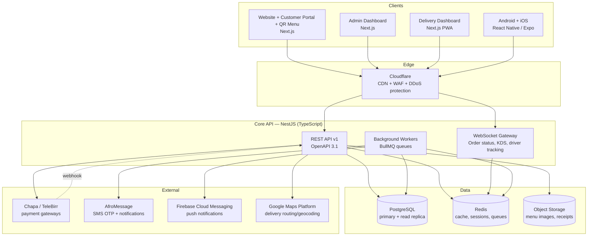

# Fresh Cup Juice House — System Architecture

## 1. Executive summary

Fresh Cup is one backend domain (menu, ordering, payments, delivery, loyalty,
inventory, analytics) exposed through a single versioned API, consumed by
six client surfaces (marketing site, customer portal, QR dine-in menu, admin
dashboard, delivery dashboard, Android/iOS apps). The design goal is: **one
source of truth for data and business rules, many thin clients**. No client
is ever allowed to embed business logic (price calculation, loyalty accrual,
inventory deduction) — that logic lives in the API only, so a bug fixed once
is fixed everywhere.

The system is built to run a single premium juice bar in Merkato today, and
to expand to multiple branches, catering, and a delivery fleet without a
rewrite. That means: branch-scoped data model from day one, stateless
services that scale horizontally, and infrastructure that costs little at
low volume but doesn't fall over at high volume.

## 2. Who uses this system

| Actor                      | Surface                                | Core needs                                                                             |
| -------------------------- | -------------------------------------- | -------------------------------------------------------------------------------------- |
| Walk-in / dine-in customer | QR Menu (web)                          | Scan table QR → browse menu → order-ahead or pay-at-counter, no login required         |
| Delivery/pickup customer   | Website, Customer Portal, Android, iOS | Browse menu, order, pay online (Chapa/TeleBirr/card), track order, earn loyalty points |
| Kitchen staff              | Kitchen Display (part of Admin)        | See incoming orders in real time, mark items in-progress/ready                         |
| Branch manager / admin     | Admin Dashboard                        | Manage menu, prices, inventory, promotions, staff, view analytics                      |
| Delivery driver            | Delivery Dashboard (PWA)               | See assigned deliveries, update status, navigate, go online/offline                    |
| Owner / HQ                 | Admin Dashboard → Analytics            | Cross-branch sales, inventory cost, customer retention                                 |

## 3. High-level architecture

Every client talks to the **same API**. There is no "admin API" vs "customer
API" split — endpoints are shared and gated by role-based authorization, so
the data model and validation logic can never drift between surfaces.

## 4. Applications and boundaries

| App             | Framework                                         | Deploys as                       | Talks to                                          |
| --------------- | ------------------------------------------------- | -------------------------------- | ------------------------------------------------- |
| `apps/api`      | NestJS (TypeScript)                               | Container (ECS Fargate)          | PostgreSQL, Redis, S3, payment/SMS/maps providers |
| `apps/web`      | Next.js (App Router)                              | Vercel or container              | `apps/api` REST + WS, public, SEO-critical        |
| `apps/admin`    | Next.js                                           | Vercel or container              | `apps/api` REST + WS, behind staff auth           |
| `apps/delivery` | Next.js (PWA, installable)                        | Vercel or container              | `apps/api` REST + WS, geolocation                 |
| `apps/mobile`   | React Native (Expo, one codebase → Android + iOS) | App Store / Play Store + EAS OTA | `apps/api` REST + WS                              |

**Boundary rule:** frontend code may format, cache, and optimistically
render data — it may never _decide_ a price, a loyalty point value, a stock
deduction, or an order-status transition. Those are API-only concerns,
enforced by code review and by the fact that clients never get direct DB
access.

## 5. Tech stack and rationale

| Layer                           | Choice                                                                                             | Why                                                                                                                                                                                                                      | Alternatives considered                                                                                                                                    |
| ------------------------------- | -------------------------------------------------------------------------------------------------- | ------------------------------------------------------------------------------------------------------------------------------------------------------------------------------------------------------------------------ | ---------------------------------------------------------------------------------------------------------------------------------------------------------- |
| Backend framework               | **NestJS + TypeScript**                                                                            | Opinionated modular structure maps 1:1 onto domain modules (Catalog, Ordering, Delivery, Loyalty...); built-in DI, guards, pipes give consistent auth/validation; same language as every frontend, enabling shared types | Django (great ORM, but splits language from the TS frontends); Go (excellent perf, but slower iteration for a small team standing up many domains at once) |
| ORM / migrations                | **Prisma**                                                                                         | Type-safe queries generated from schema, first-class migrations, works cleanly with NestJS                                                                                                                               | TypeORM (more footguns with relations at this schema size)                                                                                                 |
| Primary database                | **PostgreSQL**                                                                                     | Strong relational integrity for orders/payments/inventory; JSONB for flexible fields (modifier options); mature, cheap to run managed                                                                                    | MySQL (fine, but Postgres's constraints/enums/partial indexes fit this domain better)                                                                      |
| Cache / queues / sessions       | **Redis**                                                                                          | One piece of infra for three jobs: hot-path cache (menu, session tokens), pub/sub backing for the WebSocket gateway across multiple API instances, and BullMQ job queues                                                 | Memcached (no pub/sub, no queue support)                                                                                                                   |
| Async jobs                      | **BullMQ (Redis-backed)**                                                                          | Notifications, receipt generation, loyalty point accrual, and inventory deduction happen _after_ the order response, not blocking checkout latency                                                                       | AWS SQS (viable later; BullMQ is zero extra infra now)                                                                                                     |
| Web / Admin / Delivery frontend | **Next.js (React)**                                                                                | SSR/SSG for the SEO-critical marketing site and QR menu (fast first paint on cheap Android phones over 3G/4G), same React model reused for Admin and Delivery, App Router for streaming and layouts                      | Plain SPA (Vite) — loses SSR needed for marketing/SEO and QR-menu cold loads                                                                               |
| Mobile                          | **React Native + Expo**                                                                            | One codebase for Android and iOS, shared business logic and API client with the web apps, EAS lets us ship JS-only fixes as OTA updates without a store review cycle                                                     | Fully native Swift/Kotlin (best perf/platform fit, but ~2x team and 2x the surface for a first release; revisit once volume justifies it)                  |
| Design system                   | **Tailwind CSS + shadcn/ui (web) / NativeWind (mobile)**                                           | One token source (`packages/ui`) drives color/spacing/type on both web and native via Tailwind-compatible syntax                                                                                                         | Separate component libraries per platform (drifts visually over time)                                                                                      |
| API contract                    | **OpenAPI 3.1, contract-first**                                                                    | Single spec generates the TypeScript client used by web, admin, delivery, and mobile — no hand-maintained API client, no drift between backend and frontend types                                                        | GraphQL (adds a query layer/complexity this domain doesn't need; REST + typed client covers it)                                                            |
| Real-time                       | **WebSocket (Socket.IO) via NestJS Gateway, Redis adapter**                                        | Order-status pushes, kitchen display live updates, driver location — polling would be both slower and heavier at scale                                                                                                   | Server-Sent Events (one-directional only; driver location and KDS need bidirectional)                                                                      |
| Auth                            | **JWT (short-lived access + rotating refresh), phone OTP for customers, email+password for staff** | Phone number is the primary identifier Ethiopian customers actually use; OTP avoids forgotten passwords for a low-friction checkout                                                                                      | Session cookies only (harder to share across native mobile + multiple web subdomains)                                                                      |
| Payments                        | **Chapa** (aggregator: TeleBirr, CBE Birr, HelloCash, Amole, cards)                                | Chapa is the standard Ethiopian payment aggregator — one integration covers the wallets customers actually have; Stripe/PayPal don't support ETB payouts locally                                                         | Direct TeleBirr integration only (narrower coverage, more integration work for the same result)                                                            |
| SMS / OTP                       | **AfroMessage (or similar Ethiopian SMS gateway)**                                                 | Local delivery reliability and cost; Twilio has poor/expensive coverage into Ethiopian carriers                                                                                                                          | Twilio                                                                                                                                                     |
| Push notifications              | **Firebase Cloud Messaging**                                                                       | Single API for both Android and iOS (APNs via FCM)                                                                                                                                                                       | Native APNs + FCM separately (more moving parts, no benefit)                                                                                               |
| Object storage                  | **S3-compatible storage** (AWS S3 or DigitalOcean Spaces)                                          | Menu photos, generated receipts, exported reports                                                                                                                                                                        | —                                                                                                                                                          |
| Maps / geocoding                | **Google Maps Platform**                                                                           | Best road/address coverage for Addis Ababa for delivery routing and address autocomplete                                                                                                                                 | Mapbox (weaker local geocoding in this region)                                                                                                             |
| Monorepo tooling                | **Turborepo + pnpm workspaces**                                                                    | Shared `packages/*` (types, UI, API client, config) across five apps with cached, parallel builds                                                                                                                        | Nx (more powerful, more ceremony than this team needs at this stage)                                                                                       |

## 6. Domain modules (bounded contexts inside `apps/api`)

Each is a NestJS module with its own controllers, services, and Prisma
models — internal boundaries even though they share one database and one
deployable, so they can be split into separate services later if a specific
module (e.g., Notifications) becomes a bottleneck.

- **Identity** — customers, staff, roles/permissions, auth, OTP
- **Catalog** — categories, menu items, variants, modifiers, availability
- **Ordering** — cart, order lifecycle, order-type (dine-in/pickup/delivery), tables/QR sessions
- **Kitchen** — stations, per-item prep time, the live kitchen queue
- **Payments** — payment intents, Chapa webhook handling, refunds
- **Delivery** — drivers, zones, fee calculation, dispatch/assignment, live tracking
- **Loyalty** — points ledger, tiers, rewards catalog, redemptions
- **Promotions** — coupons, discount rules, campaigns
- **Inventory** — ingredients, recipes (menu item → ingredient mapping), stock levels, purchase orders, low-stock alerts
- **Purchasing** — suppliers, purchase-order workflow (draft/submit/receive)
- **Notifications** — SMS, push, email dispatch (consumes events from other modules)
- **Analytics** — on-demand admin dashboard/sales/item/customer reporting; a scheduled-aggregation layer is future work once order volume outgrows live queries (see `ROADMAP.md` Phase 7)
- **Intelligence** (Phase 6) — recommendations, customer/inventory/marketing intelligence, sales forecasting, executive BI, and an AI assistant, all hand-rolled statistics over the tables above — see §6a
- **Restaurant Intelligence Platform** (Phase 11, `apps/api/src/intelligence`) — wraps five of Phase 6's services with explanation/confidence framing, adds kitchen/delivery/workforce AI, and owns a swappable LLM/embedding/vector provider layer — see §6b
- **Autonomous Restaurant Intelligence Platform** (Phase 11 Part 3, same `apps/api/src/intelligence` tree) — a Human Approval Layer + governance policy engine, multi-agent AI, an autonomous decision engine, an Executive Copilot, a knowledge base, a workflow/automation engine, and a scenario simulator/digital twin, all built on §6b/§6c — see §6d
- **Audit** — a cross-cutting interceptor logging every admin mutation (actor, action, entity, after-state), not a bounded context of its own
- **Branches** — restaurant locations (one today, extensible)
- **Enterprise & Global Restaurant Platform** (Phase 12, `apps/api/src/enterprise`) — a new tenant root (`Organization`) sitting ABOVE `Branch`, multi-tenant RBAC, SSO/SCIM/WebAuthn, multi-currency/tax/localization, and cross-branch analytics — see §6e
- **AI Restaurant Operating System** (Phase 13 Task 1, `apps/api/src/modules/ai-brain`) — a rule-based memory → reasoning → prediction → recommendation → decision → learning loop, org/branch-scoped via §6e's tenancy guard, deliberately separate from every other intelligence tree above — see §6f

Modules communicate in-process via an internal event bus (Nest
`EventEmitter`) for cross-cutting concerns — e.g., `order.paid` triggers
Loyalty to accrue points and Inventory to deduct stock, without Ordering
importing either module directly. Not every cross-module interaction goes
through events, though: where one module needs to drive another's primary
state transition synchronously (Payments confirming an Order, Delivery
driving an Order's status as a driver updates), it injects that module's
service directly, the same way any two NestJS providers collaborate — the
event bus is reserved for reactive side effects (notifications, loyalty
accrual, inventory deduction, low-stock alerts), not primary writes.

### 6a. AI & Business Intelligence (Phase 6)

No Python ML service, no training pipeline, no vector database anywhere
in this stack. Every "model" in `modules/intelligence` is a few dozen
lines of TypeScript in `ml/stats.util.ts` (linear regression, a trailing-
average blend, quantile scoring for RFM, a hour/day-of-week seasonal
index) running against Prisma queries — the same "no heavy dependency for
a simple need" judgment call this codebase already made for the Phase 5
TOTP implementation and the CSV export helper. This is a deliberate scope
decision, not an oversight: at this system's order volume, hand-rolled
statistics over live SQL queries are both simpler to operate and more
than accurate enough, and reaching for a real ML framework or a separate
service would mean standing up infrastructure (training jobs, model
storage, a serving layer) this system has no evidence it needs yet.

Recommendations, customer intelligence, inventory intelligence, and
marketing intelligence follow the Analytics module's on-demand-aggregate
pattern exactly — nothing is precomputed or cached. Sales forecasting is
the one exception: it persists `ForecastSnapshot` rows (tied to a
versioned `MlModelRun`) because "forecast vs. actual" requires yesterday's
prediction to still exist today, and a `@nestjs/schedule` nightly job
regenerates them — the only scheduled/cron infrastructure anywhere in the
API.

The AI assistant reuses the dependency-inverted provider pattern from
`ChapaPaymentProvider`/`ConsoleSmsProvider`: with `ANTHROPIC_API_KEY`
configured, the Claude API (`@anthropic-ai/sdk`) drives a manual tool-use
loop against the intelligence services above and phrases the answer from
their real output; without a key (the default in dev/CI), a deterministic
keyword router calls the same tools directly. Either path is equally
"real" — the LLM, when present, only phrases pre-fetched facts, it never
originates one, and every query is logged to `AiAssistantQuery` with the
tool calls that backed the answer.

### 6b. Restaurant Intelligence Platform (Phase 11)

A second, sibling AI tree — `apps/api/src/intelligence`, distinct from
Phase 6's `modules/intelligence` (§6a), which it imports from and never
rewrites. Its job is twofold: wrap five of Phase 6's services (executive,
sales/forecasting, customer, inventory, marketing) with a uniform
explanation + 0-1 confidence score on every answer, and cover three
domains Phase 6 never touched — kitchen, delivery, workforce — computed
on demand from tables Phases 1-5 already own, no new columns needed.

**Provider abstraction.** Three interfaces — `LlmProvider`,
`EmbeddingProvider`, `VectorProvider` — each resolved by a factory reading
one env var (`LLM_PROVIDER`/`EMBEDDING_PROVIDER`/`VECTOR_PROVIDER`), so
swapping the underlying vendor is a config change, never a code change:

- **LLM**: Anthropic (reuses Phase 6's `@anthropic-ai/sdk`), one
  fetch-based OpenAI-compatible client shared by OpenAI/Azure OpenAI/
  OpenRouter/Ollama (they speak the same `/chat/completions` wire
  format), Gemini (fetch-based), and `NullLlmProvider` — the default,
  calling nothing.
- **Embeddings**: OpenAI/Voyage/Cohere (fetch-based), and
  `LocalEmbeddingProvider` — the default, a deterministic hashed
  bag-of-words vector. Same "no heavy dependency for a simple need"
  judgment call as §6a's hand-rolled statistics — real semantic
  embeddings are one config change away when a real workload needs them.
- **Vector**: OpenSearch/Pinecone/Qdrant (fetch-based), and
  `PgVectorProvider` — the default, storing embeddings in a plain
  Postgres `double precision[]` column and computing cosine similarity in
  application code. §6a's "no vector database anywhere in this stack"
  claim still holds for the out-of-the-box configuration; a real ANN
  index is a `VECTOR_PROVIDER` change away, not a rewrite.

**AI memory & RAG.** `AiMemoryService` persists conversations, business
decisions, recommendations, and accept/reject outcomes
(`AI_MEMORY_ENABLED`, on by default — the write is local and cheap).
`RagService` embeds and indexes those entries into the vector store when
`AI_RAG_ENABLED` is explicitly turned on (off by default — retrieval has
nothing to retrieve, and costs embedding-provider calls, until something
is indexed) and powers semantic recall for a later query.

**Guardrails.** Every domain method returns an `AiInsightDto`
(`title`, `explanation`, `confidence`, `data`) — Core Principles from this
phase's spec: an AI recommendation always explains itself and always
carries a confidence score, and it never performs an irreversible action.
`AiSecurityService` pattern-matches a question against what it's asking
for (API keys, passwords, secrets, JWTs, system prompts) and refuses
before it ever reaches an LLM or tool; `SecretRedactionInterceptor`
additionally scrubs secret-shaped substrings (JWTs, vendor key prefixes,
credentialed connection strings, bearer tokens) from every response body
as a second layer, applied to every controller in this tree.
`AiAuthorizationGuard` + `@RequireAiAuthorization()` are the enforcement
point for a future action-taking endpoint (none exists yet — every
current domain method only forecasts, recommends, summarizes, or
explains) requiring an explicit `x-ai-action-confirmed` header, so an
irreversible action can never be inferred from a prior request.

**`AgentRunnerService`** is the provider-agnostic version of §6a's
hand-written Anthropic tool-use loop — it drives any `LlmProvider`
through one flattened message format, and `AssistantAiService`
(`POST /admin/ai/assistant/ask`) uses it to prove the abstraction end to
end, with tools that delegate to the domain AI services above rather than
duplicating their logic. Phase 6's `AiAssistantService` is untouched and
keeps its own Claude-only tool set.

### 6c. Predictive Intelligence Platform (Phase 11 Part 2)

Built on top of §6b's tree, still without a Python ML service or a
trained-artifact pipeline anywhere in the stack — the "predictive" layer
is a disciplined arrangement of hand-rolled statistics (§6a's tradition)
behind a genuine MLOps-shaped interface: a feature store, a versioned
model registry with a deployment-stage lifecycle, calibrated confidence,
drift detection, and automatic retraining. Every prediction returns the
same `PredictionResultDto` — a value, a calibrated confidence, the
top contributing factors, and a recommended action — because Core
Principle 2/3 from this phase's spec (explain everything, confidence-score
everything) is enforced structurally, not by convention.

**Feature store → scoring → calibration pipeline.** `FeatureStoreService`
computes reusable numeric feature vectors per entity (customer, sales-day,
inventory item, kitchen station, delivery zone, marketing snapshot),
delegating to whichever Phase 6/Part 1 service already computes a given
number rather than re-deriving it. `CustomerPredictionService`'s 7
classification-style models (repeat purchase, churn, upsell, cross-sell,
coupon response, referral, satisfaction) share one hand-tuned linear-model
pipeline (`models/feature-scoring.util.ts`: a documented weight vector
dotted with the feature vector, through a sigmoid) — explicitly not fit by
gradient descent, same transparency as everywhere else in this codebase —
so every "top reason" is a real term from the same computation that
produced the score, never a post-hoc guess. Lifetime value is the
exception: it reuses Phase 6's real LTV formula directly (a genuine
regression, not a classification score) and explains itself by decomposing
that formula's own inputs. `ConfidenceCalibratorService` sits downstream
of every score: `normalize()` clamps into a sane range with no history
required, `calibrate()` replaces a raw score with its calibration bin's
empirical actual-rate once enough (predicted, actual) history exists
(`evaluation/metrics.util.ts`'s reliability-diagram-style
`calibrationCurve`), and `rejectLowConfidence()` filters out anything
below a threshold rather than surfacing a low-confidence guess.

**Model registry & retraining.** `ModelRegistryV2Service` (a new
`predictive_model_runs` table, distinct from Phase 6's forecast-only
`MlModelRun`) auto-increments a version per `modelKey` and tracks a
`PredictiveModelStage` (Experimental → Staging → Production → Archived —
promoting to Production auto-archives the previous one) plus dataset
lineage (hash/version/sample count/feature schema) on every run.
`RetrainingService` decides _whether_ to retrain (an unresolved drift
alert, enough new orders since the last training run, or a manual
request) and `RetrainingScheduler` runs that check nightly at 4 AM — after
Phase 6's 2 AM forecast job and Part 1's 3 AM digest. For `sales-*`
models, retraining calls Phase 6's `ForecastingService.regenerateAll()`
(reused, never reimplemented); every model — including the hand-weighted
ones that don't refit coefficients — gets a fresh registry row recording
what dataset the current live model was last validated against.

**Drift detection.** `DriftDetectionService` implements the Population
Stability Index by hand (bucket two distributions, compare
proportions) for feature drift and prediction drift, a relative-volume
check for data drift, and an accuracy-drop check for concept drift —
persisting a `DriftAlert` (with severity) only when a shift crosses the
standard PSI significance thresholds (>0.1 moderate, >0.25 significant).

**Configurable segmentation.** `segmentation/` defines a
`ClusteringStrategy` interface with two implementations selectable by
name: `rule-based` (default, deterministic RFM-threshold rules against
the live population, same "no heavy dependency" judgment call as Phase 6)
and `kmeans` (a genuine, deterministically-seeded Lloyd's-algorithm
implementation — no RNG, so results are reproducible). Both map to a
7-label taxonomy (High Value/VIP/Occasional/New/Dormant/At Risk/Lost)
that's deliberately distinct from Phase 6's own 6-label RFM segments —
different question, additive rather than a replacement.

### 6d. Autonomous Restaurant Intelligence Platform (Phase 11 Part 3)

Built on top of §6b/§6c's trees, this part turns the read-only insight
layer into one that can safely act: every mechanism below either drafts
into a single human-reviewed inbox or stays strictly read-only — nothing
new writes to production data without a human clicking approve.

**Human Approval Layer & governance.** `ApprovalService.request()` is the
one path anything in this part uses to propose an irreversible action; it
always writes a `PENDING` `AiApprovalRequest` row, never executes
directly. Before that write happens, `PolicyEngineService.evaluate()` runs
— it can block the request outright (`ForbiddenException`, nothing is
written) or escalate its risk level. Only an admin approving via
`POST /admin/ai/approvals/:id/approve` triggers
`ApprovalExecutorRegistry.execute()`, which maps the action type to a real
service call (purchase orders, coupons, campaigns, menu items, payments)
for the action types where a generic executor is safe to write; refunds,
staffing changes, and catch-all actions have none — approving those
records the human decision without an automatic side effect, since their
payload shapes vary too much to generalize safely. `PromptRegistryService`
fingerprints every domain's system prompt as it exists in code (reusing
§6c's dataset-hashing utility) rather than versioning a live-editable
prompt CMS this platform doesn't have.

**Multi-Agent AI.** Eight `DomainAgent` implementations (Sales, Marketing,
Inventory, Kitchen, Delivery, Finance, HR, Executive) each wrap one or two
existing §6b domain AI methods into one shared answer shape.
`CoordinatorAgentService` scores a natural-language question against each
agent's keywords, runs the matching agents in parallel, and synthesizes
their insights into a single ranked, confidence-averaged answer —
`POST /admin/ai/agents/ask` is the one endpoint a manager needs regardless
of which domain the question actually concerns.

**Autonomous Decision Engine & Executive Copilot.**
`DecisionEngineService.detectSalesDrop()` compares two trailing 7-day
`ExecutiveService.overview()` windows and, once a real drop is detected,
builds its `DecisionReason[]` only from signals this platform actually
has (revenue trend slope, order-count/foot-traffic drop, recently-expired
coupons) — there is no weather signal anywhere in the schema, so a
weather-based reason is never fabricated to fill out an explanation.
`CopilotService.ask()` chains that detection into a five-step trace
(collect via the coordinator agents → analyze/compare via the decision
engine → forecast via §6c's forecasting facade → explain via §6b's
`ExplanationService` → recommend), returning every step's timing so the
reasoning is inspectable, not just the final answer — and can optionally
stream each step over `POST /ws/ai-copilot` as it completes (step-level,
not token-level; no `LlmProvider` in this platform streams completions
yet). Its export helpers produce a real CSV, a real Markdown briefing, and
a real JSON slide outline — not rendered PDF/PPTX, a deliberate choice to
avoid a new heavy dependency.

**Restaurant memory, knowledge base, and hybrid search.** §6b's
`AiMemoryService` gained nine new memory kinds (customer preferences,
manager feedback, campaign history, supplier issues, inventory failures,
holiday demand, branch behavior, staff performance, learning digests) and
a `ConversationMemoryService` for recent-turn recall; a new
`LearningDigestScheduler` writes weekly/monthly/seasonal/yearly summarized
digests from real overview + explanation output — memory accumulation,
not model retraining, which stays §6c's job. A new `KnowledgeBaseService`
stores and indexes plain-text/Markdown documents (policies, recipes,
training manuals, food safety, HR policy, supplier agreements,
architecture/API docs); it records what a document's original format was
but does not parse PDF/DOCX/images itself — a documented scope boundary,
not a silent gap. `RagService.hybridRetrieve()` blends §6b's semantic
retrieval with a Postgres keyword match, and `VectorProvider.query()`
gained an optional metadata `filter`, genuinely implemented against the
default `PgVectorProvider` and best-effort passed through to the three
remote providers.

**Workflow engine, automation, and simulation.** Rather than a generic
if/then interpreter — a materially riskier project than the rest of this
hand-rolled platform takes on — `WorkflowEngineService` ships one fully
executed workflow: detect low stock, check for an active supplier, draft
a purchase order into the Approval Layer, and log the notify/track steps
that hand off to Phase 3's existing purchasing flow once a human approves.
`AutomationService` drafts marketing/coupon/promotion suggestions (real
executors) and kitchen/delivery/staffing suggestions (no executor — the
value is one inbox, not an auto-edited shift) from each domain AI
service's top insight. `ScenarioSimulatorService` projects "what if"
outcomes from a documented, named-constant elasticity heuristic — not
fit from real price-change history, since none exists — with an
intentionally low, hardcoded confidence; `DigitalTwinService` layers a
linear-ramp timeline on top of the same simulation. Neither service ever
calls a Prisma write — "without touching production" is enforced by what
the code never imports.

**Continuous evaluation.** `EvaluationTrackerService` logs
accuracy/precision/recall/latency per model and computes recommendation
acceptance rate and business impact from decided outcome records.
Hallucination flagging is a manual admin action, not an automatic
detector — this platform has no ground-truth signal to detect a
fabricated claim on its own.

### 6e. Enterprise & Global Restaurant Platform (Phase 12)

A new `apps/api/src/enterprise` tree, sibling to `modules/` and
`intelligence/`, additive rather than a retrofit of the 40+ tables Phases
1–11 already built. `Organization` becomes the tenant root ABOVE the
existing `Branch` model (`Branch.organizationId` is a required FK,
backfilled via a hand-sequenced migration into one default org so every
pre-Phase-12 branch is tenant-scoped from row one) — not a per-table
`organizationId` retrofit across the rest of the schema.

**Tenant isolation.** `TenantContextGuard` resolves `organizationId` from
the caller's branch (the common case) or `OrganizationMembership` for
branch-less org-level users, attaching it to `request.organizationId` for
a `@CurrentOrganization()` decorator — applied explicitly per controller
via `@UseGuards()` (the first real use of that decorator in this
codebase; `JwtAuthGuard`/`RolesGuard` are global via `APP_GUARD`). A
second, additive `OrgRole` axis (`ORG_OWNER`/`ORG_ADMIN`/
`FRANCHISE_ADMIN`/`REGION_MANAGER`, via `OrganizationMembership`) layers
on top of the existing branch-scoped `UserRole`, enforced by
`OrgRolesGuard` — a platform `UserRole.ADMIN` always bypasses both, same
precedent as `assertBranchAccess`.

**Enterprise security.** One `SsoOidcProvider` drives Google Workspace/
Entra ID/Okta/generic OIDC (real discovery, real token exchange, real
RS256 verification via Node's native `crypto` — no hand-rolled RSA); the
SAML provider builds a real AuthnRequest and parses a real Response but
does not verify the XML-DSig signature, a documented gap gated behind an
explicit env var rather than a silent shortcut. WebAuthn is built from
scratch (a minimal CBOR decoder, COSE_Key → Node `KeyObject`, real
`crypto.verify` assertion checking with signCount replay detection) as a
step-up MFA factor, not passwordless primary login. A hash-chained
`EnterpriseAuditLog` (each row covers the previous row's hash) makes
SSO/SCIM/WebAuthn/security events tamper-evident, distinct from Phase 3's
general `AuditLog`.

**Globalization.** `Currency`/`ExchangeRate` (admin-maintained, not a live
FX feed), `TaxRule` (rule-based lookup by country/region/menu-category,
not a live tax-jurisdiction API), and `RegionalPriceOverride`/
`LocalPaymentMethodConfig` (a registry over the existing `PaymentMethod`
enum and `PaymentProvider` abstraction, not a new payment rail) all
follow the same "hand-roll the lookup, don't fake a live external
integration" posture as the rest of this platform.

**Enterprise analytics.** Corporate/franchise/region/branch-group revenue
rollups, branch benchmarking, an executive scorecard, and forecast
aggregation are all built by `groupBy`-aggregating the existing `Order`
table (same `PAID_STATUSES` convention as the Phase 3 Analytics module)
and summing §6c's existing per-branch forecasts — a genuinely new
cross-branch capability, but no new query path or materialized view.

### 6f. AI Restaurant Operating System (Phase 13 Task 1)

A new `apps/api/src/modules/ai-brain/` tree — a self-contained,
org/branch-scoped memory → reasoning → prediction → recommendation →
decision → learning loop, deliberately separate from every existing
intelligence tree (§6a's `modules/intelligence`, §6b–6d's `intelligence/`,
§6e's `enterprise/analytics`). Those keep doing what they already do; this
is a simpler, rule-based/statistical foundation later phases plug real
LLM/ML/agent capability into, not a rewrite of what §6a–6e already built.

**The loop.** `MemoryEngineService` stores and recalls business events and
AI observations (`AiMemory`), ranked by an importance score.
`ReasoningEngineService` turns real Prisma aggregates — trailing-window
revenue/order-count comparisons, `InventoryItem.reorderThreshold`
breaches, distinct-customer/repeat-rate trends, and the Memory Engine's own
high-importance recall — into a structured `{problem, causes[], confidence,
evidence[]}` trace (`AiInsight`), and writes genuine anomalies back into
memory, closing the loop. `PredictionEngineService` implements a
`PredictionProvider` interface with trailing-average + linear-trend
forecasting over `Order`/`InventoryTransaction` history — the same
provider-interface-plus-swappable-implementation shape as §6b's
`LlmProvider`, so a real ML model can replace it later without any caller
changing. `RecommendationEngineService` reads the Reasoning Engine's
structured `signals` (never its prose `causes`, so a wording change can't
silently break recommendation generation) into ranked, explainable
`AiRecommendation` rows. `DecisionEngineService` combines the Prediction
Engine's forecast with the Reasoning Engine's baseline to flag genuine
demand swings, folds in every ranked recommendation, and persists the
combined, priority-sorted list as `AiDecision` executive actions.
`LearningEngineService` records what happened to a recommendation
(`AiLearningEvent`) and advances its status when the feedback names a
lifecycle transition — the loop later ML/agent engines will train against.

**Tenant isolation.** `AiBrainModule` imports §6e's `TenancyModule` (and
`IpAllowlistModule` directly, since `TenantContextGuard` depends on
`IpAllowlistService`) rather than building its own — the same cross-tree
reuse pattern `BranchesModule` established for `TenantContextService`
alone. Every handler resolves `organizationId` from `TenantContextGuard`,
never from client input; a request-supplied `branchId` is additionally
verified against the resolved organization by `AiBrainTenantScopeService`
before it's ever used in a query.

**Naming.** New models use the codebase's established `Ai` prefix
(matching §6b's `AiMemoryEntry`/`AiApprovalRequest`) rather than the
literal `AI` casing from planning. `AiMemory` and `AiLearningEvent` are
deliberately distinct from §6b's `AiMemoryEntry` (RAG-backed conversational
memory) and `AiRecommendationOutcome` (that tree's own outcome tracking) —
same concept, non-overlapping data, no shared table.

## 7. API architecture

Full detail in [`API_DESIGN.md`](API_DESIGN.md). Summary:

- REST, versioned at `/api/v1`, OpenAPI 3.1 as the source of truth
- Bearer JWT auth; role-based guards (`CUSTOMER`, `STAFF`, `MANAGER`, `DRIVER`, `ADMIN`) —
  a dedicated `KITCHEN` role (distinct from front-of-house `STAFF`) and
  `SUPER_ADMIN` (multi-branch HQ management) are deferred rather than
  modeled speculatively; today's kitchen/delivery features run on
  `STAFF`/`MANAGER`/`ADMIN` plus `DRIVER`
- Idempotency keys required on order-creation and payment endpoints
- Cursor-based pagination on all list endpoints
- RFC 7807 `problem+json` error format
- WebSocket namespaces: `/ws/orders` (customer + kitchen/staff), `/ws/delivery` (driver location + assignment), `/ws/ai-copilot` (step-level Executive Copilot streaming, Phase 11 Part 3)
- Signed webhook endpoint for Chapa payment callbacks

## 8. Data architecture

Full schema in [`DATABASE_SCHEMA.md`](DATABASE_SCHEMA.md). Summary:

- PostgreSQL as system of record; every table branch-scoped via `branch_id`
- Redis caches menu reads (short TTL, invalidated on write) and holds refresh-token/session state
- Dashboard/analytics queries run on-demand against live OLTP tables today
  (see `API_DESIGN.md`'s Admin dashboard & analytics section) — a nightly
  aggregation job materializing tables like `daily_sales_summary` is future
  work (`ROADMAP.md` Phase 7), added once order-history volume actually
  makes on-demand queries too slow, not built ahead of that need
- S3 for images/receipts; database stores URLs, not blobs

## 9. Real-time architecture

- Customer app connects to `/ws/orders`, sends a `subscribeOrder` message
  after checkout to join that order's room → receives
  `order.created`/`order.status_changed` events as the order moves
  `pending_payment → confirmed → preparing → ready → {completed |
out_for_delivery → delivered → completed}`
- Kitchen/staff auto-join their branch's room on connect → see every order
  event for their branch as it happens; the kitchen queue itself
  (`GET /admin/orders/kitchen-queue`) is still polled, not pushed
- Delivery: driver, customer, and admin connect to `/ws/delivery` and send
  a `subscribeDelivery` message to join that delivery's room; staff/manager
  auto-join their branch's room. `delivery.assigned`/`delivery.status_changed`/
  `delivery.location_updated` events fan out from there — the driver app
  pushes a location ping (`POST /delivery/driver/location`) whenever it has
  a new fix, no fixed interval enforced server-side yet
- Single Nest instance only today — the Socket.IO Redis adapter needed to
  keep rooms consistent across multiple API instances is deferred until a
  second instance actually exists to justify it

## 10. Security architecture

- **Transport:** HTTPS everywhere (TLS termination at Cloudflare + origin), HSTS
- **AuthN:** short-lived JWT access tokens (~15 min) + rotating refresh tokens (stored httpOnly, revocable); phone OTP for customers (rate-limited, expiring codes); argon2 password hashing for staff accounts
- **AuthZ:** RBAC guards on every endpoint; branch-scoping enforced at the query layer, not just the controller, so a manager token for Branch A can never read Branch B's orders
- **Input validation:** class-validator DTOs on every request; Prisma parameterizes all queries (no raw SQL string interpolation)
- **Payments:** card/wallet data never touches our servers — Chapa's hosted checkout handles it; we store only payment references and status, keeping us outside PCI-DSS scope
- **Webhooks:** Chapa callback signature verified before any order/payment state changes; replay protection via idempotency keys
- **Secrets:** environment-injected via AWS Secrets Manager, never committed; separate secrets per environment
- **Rate limiting:** per-IP and per-account limits on auth, OTP request, and checkout endpoints (Redis-backed)
- **Headers:** `helmet` defaults (CSP, X-Frame-Options, etc.) on every web-facing response
- **Uploads:** menu-image uploads validated by content-type/magic-bytes and size, re-encoded server-side before storage (blocks malicious file uploads)
- **Audit log:** every admin mutation (price change, refund, stock adjustment, role change) written to an append-only `audit_log` table with actor, before/after, timestamp
- **Dependency hygiene:** Dependabot/Renovate + `npm audit` in CI, blocking merges on high/critical vulnerabilities
- **Data protection:** aligned with Ethiopia's Personal Data Protection Proclamation — explicit consent on signup, data export/delete endpoints for customers, minimal retention on OTP codes and raw payment logs

## 11. Scalability and performance

- Stateless API containers behind a load balancer → horizontal auto-scaling (ECS Fargate service auto-scaling on CPU + request count)
- Postgres read replica for analytics/reporting traffic, keeping heavy queries off the primary that checkout depends on
- Redis caches the menu (read-heavy, write-rare) with short TTL + explicit invalidation on admin edits
- CDN (Cloudflare) in front of all static assets and Next.js static output; images served via an image-optimization pipeline (resize/WebP) so a customer on a slow Addis Ababa mobile connection isn't downloading full-resolution photos
- Async work (SMS, push, receipts, loyalty accrual, inventory deduction) offloaded to BullMQ workers so checkout latency isn't gated on third-party API calls
- Database: indexes on all foreign keys and common filters (`orders.status`, `orders.branch_id, created_at`), `orders` table partitioned by month once volume warrants it
- Connection pooling via PgBouncer between API containers and Postgres
- Designed for one branch today, `branch_id` on every relevant table means adding branch #2 is a data-entry operation, not a migration

## 12. Localization and regional considerations

- **Bilingual from the start:** English + Amharic (i18n via `next-intl` on web, `i18n-js` on mobile); all customer-facing copy and menu content stored with locale variants
- **Currency:** ETB as the only currency; prices stored as integer cents-equivalent (lowest denomination) to avoid float rounding bugs
- **Phone numbers:** normalized to `+251` E.164 format; phone is the primary customer identifier (OTP login), matching how most customers actually authenticate day to day
- **Payments:** Chapa covers TeleBirr, CBE Birr, HelloCash, Amole, and cards in one integration — no customer is forced onto a payment method they don't have
- **Bandwidth:** aggressive image compression, code-splitting, and a "data saver" mode on mobile (lower-res images, fewer background polls) since mobile data cost/coverage varies across Addis Ababa
- **Addresses:** Addis Ababa doesn't use a formal postal-address system the way many markets do; delivery addresses are captured as free-text + pinned map location (lat/lng) rather than structured street/postal fields

## 13. Observability

Implemented as of Phase 12 Part 5 (`apps/api/src/common/observability/`,
`infra/observability/`, `infra/backup/`) — see `DEPLOYMENT.md` for the
Kubernetes/CI-CD/DR side:

- **Logs:** `JsonLoggerService` emits JSON-lines to stdout, each line
  carrying a `traceId` propagated through `RequestContextService`
  (Node `AsyncLocalStorage`, generated or taken from an inbound
  `x-trace-id` header) — the format a log-aggregation pipeline expects to
  parse without a regex. `infra/observability/fluent-bit-configmap.yaml`
  ships them into Loki.
- **Metrics:** `GET /metrics` (prom-client — a small, purpose-built
  dependency, not hand-rolled, since the Prometheus exposition format has
  real edge cases) exposes request-duration histograms, request counters,
  and default Node process metrics; `infra/observability/prometheus-scrape-config.yaml`
  auto-discovers pods via their `prometheus.io/scrape` annotation.
- **Tracing:** correlation-ID tracing via the same `traceId`, not full
  OpenTelemetry span auto-instrumentation — a documented scope decision
  (see `RequestContextService`'s docblock and
  `infra/observability/otel-collector-config.yaml`), since wiring
  `@opentelemetry/sdk-node` is a large new dependency tree left as
  deliberate future work.
- **Alerting:** `infra/observability/alert-rules.yaml` (a
  `PrometheusRule`) covers 5xx rate, p95 latency, pod crash-looping,
  degraded `/health/ready` dependencies, HPA saturation, and a failed
  weekly backup-restore test.
- **Health checks:** `GET /health` (liveness — never touches
  Postgres/Redis, so a dependency outage doesn't trigger a restart loop)
  and `GET /health/ready` (readiness — checks both) from Phase 1, wired
  to Kubernetes probes in `infra/k8s/base/api-deployment.yaml`.
- **Business metrics:** order volume, GMV, average prep time, and
  delivery SLA surfaced directly in the Admin Analytics module (not just
  infra dashboards) — unchanged from Phase 3/5.
- **Still aspirational, not built:** error tracking (Sentry), a hosted
  metrics/log backend actually running (Grafana Cloud, Loki, Tempo —
  the configs above are valid and reviewed but have no live backend to
  point at in this environment), synthetic uptime checks, and
  PagerDuty/Slack paging.

## 14. Testing strategy

- **Unit tests:** service-layer logic per domain module (pricing, loyalty accrual, inventory deduction) — these are the rules that must never silently break
- **Integration tests:** API endpoints against a real Postgres test database (Testcontainers), covering auth, ordering, and payment-webhook flows
- **Contract tests:** generated OpenAPI client is type-checked against each frontend app in CI — a breaking API change fails the build before it ships
- **E2E tests:** Playwright for web/admin critical paths (browse → cart → checkout), Detox or Maestro for the mobile app's order flow
- **Load testing:** k6 scripted against checkout and menu-read endpoints before major promotions/launches

## 15. Deployment architecture

See [`DEPLOYMENT.md`](DEPLOYMENT.md) for environments, infra-as-code, and the CI/CD pipeline.

## 16. Roadmap

See [`ROADMAP.md`](ROADMAP.md) for the phased build-out from foundations through multi-branch scale.
