# Database Schema

PostgreSQL. Every business table carries `branch_id` so the schema supports
multiple locations without a future migration — Fresh Cup runs one branch
(Merkato) today, but the cost of scoping now is one extra foreign key,
versus a painful retrofit later. All primary keys are client-generated
UUIDv4 (Prisma's default) rather than a DB-generated UUIDv7 — no Postgres
extension needed, identical behavior in every environment; index locality
isn't a concern at this volume. Money is stored as integer minor units
(cents-equivalent) to avoid floating-point rounding.

## 1. Entity-relationship overview

```mermaid
erDiagram
    BRANCHES ||--o{ MENU_ITEMS : offers
    BRANCHES ||--o{ TABLES : has
    BRANCHES ||--o{ MODIFIER_GROUPS : defines
    BRANCHES ||--o{ CARTS : scopes
    BRANCHES ||--o{ ORDERS : fulfills
    BRANCHES ||--o{ STAFF : employs
    BRANCHES ||--o{ INVENTORY_ITEMS : stocks
    BRANCHES ||--o{ DELIVERY_ZONES : serves

    USERS ||--o{ ORDERS : places
    USERS ||--o{ CARTS : owns
    USERS ||--o{ ADDRESSES : owns
    USERS ||--o{ PUSH_TOKENS : registers
    USERS ||--o{ LOYALTY_LEDGER : accrues
    USERS ||--o{ REVIEWS : writes
    USERS ||--o| RIDER_PROFILES : "is a"

    MENU_CATEGORIES ||--o{ MENU_ITEMS : groups
    MENU_ITEMS ||--o{ MENU_ITEM_MODIFIER_GROUPS : has
    MODIFIER_GROUPS ||--o{ MODIFIER_OPTIONS : contains
    MENU_ITEM_MODIFIER_GROUPS }o--|| MODIFIER_GROUPS : references
    MENU_ITEMS ||--o{ RECIPE_INGREDIENTS : requires
    INVENTORY_ITEMS ||--o{ RECIPE_INGREDIENTS : "used in"

    CARTS ||--o{ CART_ITEMS : contains
    CART_ITEMS ||--o{ CART_ITEM_MODIFIERS : customized_with

    ORDERS ||--|{ ORDER_ITEMS : contains
    ORDER_ITEMS ||--o{ ORDER_ITEM_MODIFIERS : customized_with
    ORDERS ||--o{ PAYMENTS : "paid by (may retry)"
    ORDERS ||--o| DELIVERIES : "fulfilled by"
    ORDERS ||--o| ADDRESSES : "delivered to"
    ORDERS ||--o| TABLES : "ordered at"
    ORDERS ||--o| COUPON_REDEMPTIONS : applies
    ORDERS ||--o{ ORDER_STATUS_HISTORY : logs

    DELIVERIES ||--o| RIDER_PROFILES : assigned_to
    DELIVERIES ||--o{ DELIVERY_TRACKING_PINGS : logs

    COUPONS ||--o{ COUPON_REDEMPTIONS : redeemed_as

    INVENTORY_ITEMS ||--o{ INVENTORY_TRANSACTIONS : adjusted_by
    INVENTORY_ITEMS ||--o{ PURCHASE_ORDER_LINES : restocked_by
    PURCHASE_ORDERS ||--o{ PURCHASE_ORDER_LINES : contains
    SUPPLIERS ||--o{ PURCHASE_ORDERS : fulfills
```



## 2. Core tables

### `branches`

Restaurant locations. One row today (Merkato).

| Column                 | Type        | Notes                                                   |
| ---------------------- | ----------- | ------------------------------------------------------- |
| id                     | uuid PK     |                                                         |
| name                   | text        | e.g. "Fresh Cup — Merkato"                              |
| address_text           | text        | free-text, Addis Ababa addressing                       |
| lat, lng               | numeric     | for delivery-zone geometry & maps                       |
| phone                  | text        |                                                         |
| is_active              | boolean     |                                                         |
| opens_at, closes_at    | time        | per-day hours modeled in `branch_hours` if needed later |
| created_at, updated_at | timestamptz |                                                         |

### `users`

Customers **and** staff share one identity table, differentiated by `role`.
Implemented in Phase 1 with four roles (`customer`, `staff`, `manager`,
`admin`); operational roles the platform doesn't have features for yet
(`kitchen`, `rider`, `super_admin`) are added in the phases that introduce
kitchen display, delivery, and multi-branch HQ management rather than
modeled speculatively now.

| Column                 | Type               | Notes                                              |
| ---------------------- | ------------------ | -------------------------------------------------- |
| id                     | uuid PK            |                                                    |
| phone                  | text UNIQUE NULL   | E.164, primary login identifier for customers      |
| email                  | text UNIQUE NULL   | required for staff, unused by phone-only customers |
| password_hash          | text NULL          | NULL for OTP-only customers                        |
| full_name              | text               |                                                    |
| role                   | enum               | `customer`, `staff`, `manager`, `admin`            |
| branch_id              | uuid FK → branches | NULL for customers/admin (not branch-scoped)       |
| locale                 | enum               | `en`, `am`                                         |
| is_active              | boolean            |                                                    |
| created_at, updated_at | timestamptz        |                                                    |

`loyalty_tier` is deferred to Phase 4 (Loyalty & promotions) rather than
carried as an unused column until that ledger exists.

### `otp_codes`

| id, phone, code_hash, expires_at, consumed_at, attempt_count, created_at |

### `refresh_tokens`

Not in the original design — added during Phase 1 auth implementation.
Refresh tokens are opaque random values (never JWTs), stored only as a
hash, so a token can be revoked or rotated server-side on every use.

| id, user_id FK, token_hash UNIQUE, expires_at, revoked_at, replaced_by_token_id, created_at |

### `addresses`

| id, user_id FK, label, free_text, lat, lng, is_default, created_at |

## 3. Catalog

### `menu_categories`

| id, branch_id FK, name_en, name_am, sort_order, is_active |

### `menu_items`

| id, branch_id FK, category_id FK, name_en, name_am, description_en, description_am, base_price, is_available, calories, tags (text[] e.g. `vegan`,`no-sugar-added`), sort_order, created_at, updated_at |

### `menu_item_images`

Implemented instead of a single `image_url` column — a product can carry a
gallery, with one entry flagged primary. URL-based (the client registers an
already-hosted URL); there is no multipart upload pipeline yet, so images
are uploaded to object storage out-of-band.

| id, menu_item_id FK, url, alt_text, is_primary, sort_order, created_at |

### Product modifiers: `modifier_groups`, `modifier_options`, `menu_item_modifier_groups`

Implemented in Phase 2. A group is reusable across menu items (e.g. "Size");
`menu_item_modifier_groups` is the attachment, carrying a per-item
`is_required`/`sort_order` override so the same group can be required on
one item and optional on another. No separate `menu_item_variants` table —
a SINGLE-selection modifier group (e.g. "Size": Small/Medium/Large) covers
that case without a second concept.

#### `modifier_groups`

| id, branch_id FK, name_en, name_am, selection_type (`single`,`multiple`), min_select, max_select NULL (NULL = unlimited, MULTIPLE only), is_active, created_at, updated_at |

#### `modifier_options`

| id, modifier_group_id FK, name_en, name_am, price_delta (minor units, added to base_price), is_active, sort_order, created_at, updated_at |

#### `menu_item_modifier_groups`

| id, menu_item_id FK, modifier_group_id FK, is_required, sort_order, created_at | — unique on (menu_item_id, modifier_group_id)

### `tables`

QR dine-in tables. Implemented in Phase 2 — `qr_token` is a generated
high-entropy opaque token (not a sequential id), regeneratable to
invalidate a previously-printed code.

| id, branch_id FK, label (e.g. "T-12"), qr_token UNIQUE, is_active, created_at, updated_at |

## 4. Cart

Implemented in Phase 2 — server-persisted so it survives across devices.
One row per (user_id, branch_id); checkout consumes and clears it rather
than tracking a cart lifecycle status. Unlike `order_items`, cart rows
don't snapshot name/price — they always reflect current catalog data,
which is the whole point of a cart versus an order.

### `carts`

| id, user_id FK, branch_id FK, created_at, updated_at | — unique on (user_id, branch_id)

### `cart_items`

| id, cart_id FK, menu_item_id FK, quantity, notes NULL, created_at, updated_at |

### `cart_item_modifiers`

| id, cart_item_id FK, modifier_option_id FK, created_at | — unique on (cart_item_id, modifier_option_id); FK cascades on delete so a discontinued option doesn't strand a cart line

## 5. Ordering

Implemented in Phase 2. `POST /orders` (checkout) reads the caller's cart,
re-validates it against the live catalog, and writes everything below in
one transaction — including clearing the cart.

### `orders`

Unlike the original sketch, `user_id` is `NOT NULL`: Phase 2 requires
authentication for checkout (Phase 1's OTP login is already frictionless),
so guest dine-in ordering was deliberately deferred rather than adding
guest-session complexity nothing has asked for yet.

| Column                                                        | Type                               | Notes                                                                                                                                                   |
| ------------------------------------------------------------- | ---------------------------------- | ------------------------------------------------------------------------------------------------------------------------------------------------------- |
| id                                                            | uuid PK                            |                                                                                                                                                         |
| branch_id                                                     | uuid FK                            |                                                                                                                                                         |
| user_id                                                       | uuid FK                            | `NOT NULL` — see above                                                                                                                                  |
| order_type                                                    | enum                               | `dine_in`, `pickup`, `delivery`                                                                                                                         |
| table_id                                                      | uuid FK NULL                       | set when `dine_in`                                                                                                                                      |
| address_id                                                    | uuid FK NULL, `ON DELETE SET NULL` | set when `delivery`; the order keeps its own snapshot below regardless of what happens to the address later                                             |
| delivery_address_text, delivery_lat, delivery_lng             | text/numeric NULL                  | snapshotted from the address at order time — edits/deletes to the live address never change a placed order                                              |
| status                                                        | enum                               | `pending_payment`, `confirmed`, `preparing`, `ready`, `out_for_delivery`, `delivered`, `completed`, `cancelled`                                         |
| subtotal, discount_total, delivery_fee, tax_total, total      | integer (minor units)              | `delivery_fee` is a flat MVP rate (`DELIVERY_FLAT_FEE`) until Phase 3's zone/distance quoting; `tax_total` is 0 unless `TAX_RATE_PERCENT` is configured |
| currency                                                      | text                               | `ETB`                                                                                                                                                   |
| coupon_id                                                     | uuid FK NULL                       | references `coupons`; the actual redemption row lives in `coupon_redemptions`                                                                           |
| idempotency_key                                               | text UNIQUE                        | a retried checkout with the same key replays this order instead of creating a duplicate                                                                 |
| notes                                                         | text NULL                          | customer-supplied note for the whole order                                                                                                              |
| placed_at, confirmed_at, ready_at, delivered_at, cancelled_at | timestamptz NULL                   | set as the corresponding status is reached                                                                                                              |
| created_at, updated_at                                        | timestamptz                        |                                                                                                                                                         |

### `order_items`

Snapshots `name`/`unit_price` at order time — later catalog edits never
change a historical order. No `variant_id` (no separate variants concept;
see modifiers above).

| id, order_id FK, menu_item_id FK, name_snapshot, unit_price, quantity, line_total, notes NULL, created_at |

### `order_item_modifiers`

Also snapshots name/price. `modifier_option_id` is nullable with `ON
DELETE SET NULL` — if the option is later deleted, the historical order
keeps its snapshot values regardless.

| id, order_item_id FK, modifier_option_id FK NULL, name_snapshot, price_delta_snapshot, created_at |

### `order_status_history`

Implemented in Phase 2 — an append-only audit trail powering "Order
Timeline" (`GET /orders/{id}/timeline`), independent of the timestamp
columns cached on `orders`.

| id, order_id FK, from_status enum NULL, to_status enum, changed_by_user_id FK NULL (NULL = system, e.g. a payment webhook), note NULL, created_at |

## 6. Payments

Implemented in Phase 2.

### `payments`

An order can have multiple payment rows (a failed/abandoned Chapa attempt
followed by a retry); only one is expected to reach `succeeded`.

| id, order_id FK, provider (`chapa`,`cash`), provider_reference UNIQUE NULL, method (`telebirr`,`cbe_birr`,`hellocash`,`amole`,`card`,`cash`), amount, currency, status (`initiated`,`succeeded`,`failed`,`refunded`), raw_webhook_payload jsonb NULL, initiated_at, completed_at NULL, created_at, updated_at |

## 7. Delivery (Phase 3 — not yet implemented)

Phase 2 supports `orderType: delivery` as a checkout option using the
`orders.delivery_*` snapshot columns and a flat MVP fee; it does not
assign or track a rider. The tables below are Phase 3 design, unbuilt:

### `delivery_zones`

| id, branch_id FK, name, polygon (geometry / stored as GeoJSON), base_fee, per_km_fee |

### `rider_profiles`

| user_id FK PK, vehicle_type, license_plate, is_online, current_lat, current_lng, last_ping_at |

### `deliveries`

| id, order_id FK, rider_id FK NULL, status (`unassigned`,`assigned`,`picked_up`,`en_route`,`delivered`,`failed`), assigned_at, picked_up_at, delivered_at, distance_km, fee |

### `delivery_tracking_pings`

| id, delivery_id FK, lat, lng, recorded_at | — append-only, short retention (e.g. 30 days), used for the live map and post-hoc SLA analysis |

## 8. Promotions & loyalty

### `coupons`, `coupon_redemptions`

Implemented in Phase 2 — validated and redeemed atomically at checkout
(`POST /orders` with `couponCode`), enforcing the active window,
`min_order_total`, and both redemption caps below.

| Table                | Columns                                                                                                                                                                                                                   |
| -------------------- | ------------------------------------------------------------------------------------------------------------------------------------------------------------------------------------------------------------------------- |
| `coupons`            | id, code UNIQUE, discount_type (`percent`,`amount`,`free_delivery`), value, min_order_total NULL, starts_at NULL, expires_at NULL, max_redemptions NULL, max_redemptions_per_user NULL, is_active, created_at, updated_at |
| `coupon_redemptions` | id, coupon_id FK, user_id FK, order_id FK UNIQUE, redeemed_at                                                                                                                                                             |

### `loyalty_ledger`

Implemented in Phase 2 as **accrual only** — append-only, `balance_after`
cached per row so history never needs a recompute. Tied to a payment
reaching `succeeded` (via the `order.paid` event), not to order placement
or confirmation, so a cancelled/no-show order never earns points. Reasons
are currently just `order_earned` and `manual_adjustment`; `redeemed`,
`bonus`, and `expired` are added in Phase 4 alongside the redemption flow
itself.

| id, user_id FK, order_id FK NULL, points_delta, reason (`order_earned`,`manual_adjustment`), balance_after, created_at |

### `rewards_catalog` (Phase 4 — not yet implemented)

| id, name_en, name_am, points_cost, reward_type (`free_item`,`discount_percent`,`discount_amount`), menu_item_id FK NULL, is_active |

## 9. Notifications

Implemented in Phase 2. SMS/email/push are each a dependency-inverted
provider interface (console/log-only implementations pending real
gateways); every dispatch attempt is logged regardless of outcome.

### `push_tokens`

| id, user_id FK, token UNIQUE, platform (`ios`,`android`,`web`), created_at |

### `notification_logs`

| id, user_id FK NULL, channel (`email`,`sms`,`push`), type (e.g. `order_created`, `order_status_changed`, `order_paid`), payload jsonb, status (`sent`,`failed`,`skipped`), error NULL, created_at |

## 10. Inventory

Phase 1 ships the base ledger (`inventory_items` + `inventory_transactions`)
with a manual adjustment API. Recipe-based auto-deduction, suppliers, and
purchase orders are Phase 5 (Full inventory management) — Phase 2 orders
don't touch inventory yet.

### `inventory_items`

| id, branch_id FK, name, unit (`gram`,`milliliter`,`unit`), current_stock, reorder_threshold, unit_cost, is_active |

### `inventory_transactions`

Append-only; every stock change is a row. Only `manual_adjustment`,
`restock`, and `waste` reasons exist so far — `order_deduction` is added
in Phase 5 once menu items carry a recipe (ingredient mapping) to deduct
against.

| id, inventory_item_id FK, delta, reason (`manual_adjustment`,`restock`,`waste`), note, actor_user_id FK NULL, created_at |

### `recipe_ingredients`, `suppliers` / `purchase_orders` / `purchase_order_lines`

Deferred to Phase 5 — recipe-based deduction is meaningless before orders
exist, and procurement workflow isn't core ordering functionality.

## 11. Reviews & audit

### `reviews`

| id, user_id FK, order_id FK, rating (1-5), comment, created_at |

### `audit_log`

| id, actor_user_id FK, action, entity_type, entity_id, before jsonb, after jsonb, created_at | — every admin mutation

## 12. Analytics (materialized, refreshed nightly)

- `daily_sales_summary(branch_id, date, order_count, gmv, avg_order_value, delivery_count, pickup_count, dine_in_count)`
- `item_performance(branch_id, menu_item_id, date, units_sold, revenue)`
- `customer_cohort_retention(branch_id, cohort_month, months_since, retained_customers)`

These exist purely so the Admin Analytics dashboard never runs expensive
aggregate queries against the live `orders`/`order_items` tables that
checkout depends on.

## 13. Indexing notes

- `orders(branch_id, status, created_at)` — kitchen queue & admin order list
- `orders(user_id, created_at)` — customer order history
- `order_items(order_id)`, `order_status_history(order_id, created_at)` — order detail/timeline reads
- `payments(order_id)` — payment lookups by order
- `menu_items(branch_id, category_id, is_available)` — menu reads (also cached in Redis)
- `cart_items(cart_id)` — cart reads
- `loyalty_ledger(user_id, created_at)` — points history
- `notification_logs(user_id, created_at)` — notification history
- `delivery_tracking_pings(delivery_id, recorded_at)` — live tracking replay (Phase 3)
- Partition `orders` and `delivery_tracking_pings` by month once volume warrants it (Phase 7)

## 14. Sample DDL sketch (illustrative, not exhaustive)

```sql
create type order_status as enum (
  'pending_payment','confirmed','preparing','ready',
  'out_for_delivery','delivered','completed','cancelled'
);

create table branches (
  id uuid primary key default gen_random_uuid(),
  name text not null,
  address_text text not null,
  lat numeric(9,6),
  lng numeric(9,6),
  phone text,
  is_active boolean not null default true,
  created_at timestamptz not null default now(),
  updated_at timestamptz not null default now()
);

create table orders (
  id uuid primary key default gen_random_uuid(),
  branch_id uuid not null references branches(id),
  user_id uuid not null references users(id),
  order_type text not null check (order_type in ('dine_in','pickup','delivery')),
  table_id uuid references tables(id),
  address_id uuid references addresses(id) on delete set null,
  status order_status not null default 'pending_payment',
  subtotal integer not null,
  discount_total integer not null default 0,
  delivery_fee integer not null default 0,
  tax_total integer not null default 0,
  total integer not null,
  currency text not null default 'ETB',
  idempotency_key text not null unique,
  placed_at timestamptz not null default now(),
  confirmed_at timestamptz,
  ready_at timestamptz,
  delivered_at timestamptz,
  cancelled_at timestamptz,
  created_at timestamptz not null default now(),
  updated_at timestamptz not null default now()
);

create index orders_branch_status_idx on orders (branch_id, status, created_at);
create index orders_user_idx on orders (user_id, created_at);
```

This sketch predates implementation and is kept only as a readable
overview — `apps/api/prisma/schema.prisma` (plus its generated
`prisma/migrations/`) is the actual source of truth for every table,
constraint, and index; consult it, not this file, for exact types and
`onDelete` behavior.
