# Database Schema

PostgreSQL. Every business table carries `branch_id` so the schema supports
multiple locations without a future migration — Fresh Cup runs one branch
(Merkato) today, but the cost of scoping now is one extra foreign key,
versus a painful retrofit later. All primary keys are client-generated
UUIDv4 (Prisma's default) rather than a DB-generated UUIDv7 — no Postgres
extension needed, identical behavior in every environment; index locality
isn't a concern at this volume. Money is stored as integer minor units
(cents-equivalent) to avoid floating-point rounding.

## 1. Entity-relationship overview

```mermaid
erDiagram
    BRANCHES ||--o{ MENU_ITEMS : offers
    BRANCHES ||--o{ TABLES : has
    BRANCHES ||--o{ MODIFIER_GROUPS : defines
    BRANCHES ||--o{ CARTS : scopes
    BRANCHES ||--o{ ORDERS : fulfills
    BRANCHES ||--o{ USERS : employs
    BRANCHES ||--o{ INVENTORY_ITEMS : stocks
    BRANCHES ||--o{ DELIVERY_ZONES : serves
    BRANCHES ||--o{ KITCHEN_STATIONS : has
    BRANCHES ||--o{ SUPPLIERS : sources_from
    BRANCHES ||--o{ PURCHASE_ORDERS : issues

    USERS ||--o{ ORDERS : places
    USERS ||--o{ CARTS : owns
    USERS ||--o{ ADDRESSES : owns
    USERS ||--o{ PUSH_TOKENS : registers
    USERS ||--o{ LOYALTY_LEDGER : accrues
    USERS ||--o{ REVIEWS : writes
    USERS ||--o| DRIVER_PROFILES : "is a"
    USERS ||--o{ DELIVERIES : "delivers as driver"
    USERS ||--o{ AUDIT_LOGS : "acts as actor"

    MENU_CATEGORIES ||--o{ MENU_ITEMS : groups
    MENU_ITEMS ||--o{ MENU_ITEM_MODIFIER_GROUPS : has
    MODIFIER_GROUPS ||--o{ MODIFIER_OPTIONS : contains
    MENU_ITEM_MODIFIER_GROUPS }o--|| MODIFIER_GROUPS : references
    MENU_ITEMS ||--o{ RECIPE_INGREDIENTS : requires
    MENU_ITEMS }o--o| KITCHEN_STATIONS : "routed to"
    INVENTORY_ITEMS ||--o{ RECIPE_INGREDIENTS : "used in"

    CARTS ||--o{ CART_ITEMS : contains
    CART_ITEMS ||--o{ CART_ITEM_MODIFIERS : customized_with

    ORDERS ||--|{ ORDER_ITEMS : contains
    ORDER_ITEMS ||--o{ ORDER_ITEM_MODIFIERS : customized_with
    ORDERS ||--o{ PAYMENTS : "paid by (may retry)"
    ORDERS ||--o| DELIVERIES : "fulfilled by"
    ORDERS ||--o| ADDRESSES : "delivered to"
    ORDERS ||--o| TABLES : "ordered at"
    ORDERS ||--o| COUPON_REDEMPTIONS : applies
    ORDERS ||--o{ ORDER_STATUS_HISTORY : logs

    DELIVERY_ZONES ||--o{ DELIVERIES : covers
    DELIVERIES ||--o{ DELIVERY_TRACKING_PINGS : logs

    COUPONS ||--o{ COUPON_REDEMPTIONS : redeemed_as

    INVENTORY_ITEMS ||--o{ INVENTORY_TRANSACTIONS : adjusted_by
    INVENTORY_ITEMS ||--o{ PURCHASE_ORDER_LINES : restocked_by
    PURCHASE_ORDERS ||--o{ PURCHASE_ORDER_LINES : contains
    SUPPLIERS ||--o{ PURCHASE_ORDERS : fulfills
```



## 2. Core tables

### `branches`

Restaurant locations. One row today (Merkato).

| Column                 | Type        | Notes                                                                               |
| ---------------------- | ----------- | ----------------------------------------------------------------------------------- |
| id                     | uuid PK     |                                                                                     |
| name                   | text        | e.g. "Fresh Cup — Merkato"                                                          |
| address_text           | text        | free-text, Addis Ababa addressing                                                   |
| lat, lng               | numeric     | for delivery-zone geometry & maps                                                   |
| phone                  | text        |                                                                                     |
| is_active              | boolean     |                                                                                     |
| opens_at, closes_at    | time        | flat fallback pair; real per-day scheduling is `branch_hours` (Phase 5, section 14) |
| created_at, updated_at | timestamptz |                                                                                     |

### `users`

Customers **and** staff share one identity table, differentiated by `role`.
Implemented in Phase 1 with four roles (`customer`, `staff`, `manager`,
`admin`); Phase 3 added a fifth, `driver`, with a 1:1 `driver_profiles`
extension table (mirroring how an operational role gets its own extension
table rather than bloating `users` with driver-only columns). A dedicated
`kitchen` role (distinct from front-of-house `staff`) and `super_admin`
(multi-branch HQ management) are still deferred rather than modeled
speculatively — Phase 3's kitchen/delivery features run on
`staff`/`manager`/`admin` plus the new `driver`.

| Column                 | Type               | Notes                                              |
| ---------------------- | ------------------ | -------------------------------------------------- |
| id                     | uuid PK            |                                                    |
| phone                  | text UNIQUE NULL   | E.164, primary login identifier for customers      |
| email                  | text UNIQUE NULL   | required for staff, unused by phone-only customers |
| password_hash          | text NULL          | NULL for OTP-only customers                        |
| full_name              | text               |                                                    |
| role                   | enum               | `customer`, `staff`, `manager`, `driver`, `admin`  |
| branch_id              | uuid FK → branches | NULL for customers/admin (not branch-scoped)       |
| locale                 | enum               | `en`, `am`                                         |
| is_active              | boolean            |                                                    |
| created_at, updated_at | timestamptz        |                                                    |

A persisted `loyalty_tier` column is deferred to Phase 10 (Loyalty rewards
& promotions campaigns) rather than carried as an unused column until that
redemption ledger exists. Phase 6's `CustomerIntelligenceService`
computes a read-only Bronze/Silver/Gold tier on demand from
`loyalty_ledger`'s lifetime accrual instead — see "AI & Business
Intelligence" below.

### `otp_codes`

| id, phone, code_hash, expires_at, consumed_at, attempt_count, created_at |

### `refresh_tokens`

Not in the original design — added during Phase 1 auth implementation.
Refresh tokens are opaque random values (never JWTs), stored only as a
hash, so a token can be revoked or rotated server-side on every use.

| id, user_id FK, token_hash UNIQUE, expires_at, revoked_at, replaced_by_token_id, created_at |

### `addresses`

| id, user_id FK, label, free_text, lat, lng, is_default, created_at |

## 3. Catalog

### `menu_categories`

| id, branch_id FK, name_en, name_am, sort_order, is_active |

### `menu_items`

| id, branch_id FK, category_id FK, name_en, name_am, description_en, description_am, base_price, is_available, calories, tags (text[] e.g. `vegan`,`no-sugar-added`), sort_order, prep_time_seconds (default 180, Phase 3), station_id FK NULL `ON DELETE SET NULL` → kitchen_stations (Phase 3), created_at, updated_at |

### `menu_item_images`

Implemented instead of a single `image_url` column — a product can carry a
gallery, with one entry flagged primary. URL-based (the client registers an
already-hosted URL); there is no multipart upload pipeline yet, so images
are uploaded to object storage out-of-band.

| id, menu_item_id FK, url, alt_text, is_primary, sort_order, created_at |

### Product modifiers: `modifier_groups`, `modifier_options`, `menu_item_modifier_groups`

Implemented in Phase 2. A group is reusable across menu items (e.g. "Size");
`menu_item_modifier_groups` is the attachment, carrying a per-item
`is_required`/`sort_order` override so the same group can be required on
one item and optional on another. No separate `menu_item_variants` table —
a SINGLE-selection modifier group (e.g. "Size": Small/Medium/Large) covers
that case without a second concept.

#### `modifier_groups`

| id, branch_id FK, name_en, name_am, selection_type (`single`,`multiple`), min_select, max_select NULL (NULL = unlimited, MULTIPLE only), is_active, created_at, updated_at |

#### `modifier_options`

| id, modifier_group_id FK, name_en, name_am, price_delta (minor units, added to base_price), is_active, sort_order, created_at, updated_at |

#### `menu_item_modifier_groups`

| id, menu_item_id FK, modifier_group_id FK, is_required, sort_order, created_at | — unique on (menu_item_id, modifier_group_id)

### `tables`

QR dine-in tables. Implemented in Phase 2 — `qr_token` is a generated
high-entropy opaque token (not a sequential id), regeneratable to
invalidate a previously-printed code.

| id, branch_id FK, label (e.g. "T-12"), qr_token UNIQUE, is_active, created_at, updated_at |

## 4. Cart

Implemented in Phase 2 — server-persisted so it survives across devices.
One row per (user_id, branch_id); checkout consumes and clears it rather
than tracking a cart lifecycle status. Unlike `order_items`, cart rows
don't snapshot name/price — they always reflect current catalog data,
which is the whole point of a cart versus an order.

### `carts`

| id, user_id FK, branch_id FK, created_at, updated_at | — unique on (user_id, branch_id)

### `cart_items`

| id, cart_id FK, menu_item_id FK, quantity, notes NULL, created_at, updated_at |

### `cart_item_modifiers`

| id, cart_item_id FK, modifier_option_id FK, created_at | — unique on (cart_item_id, modifier_option_id); FK cascades on delete so a discontinued option doesn't strand a cart line

## 5. Ordering

Implemented in Phase 2. `POST /orders` (checkout) reads the caller's cart,
re-validates it against the live catalog, and writes everything below in
one transaction — including clearing the cart.

### `orders`

Unlike the original sketch, `user_id` is `NOT NULL`: Phase 2 requires
authentication for checkout (Phase 1's OTP login is already frictionless),
so guest dine-in ordering was deliberately deferred rather than adding
guest-session complexity nothing has asked for yet.

| Column                                                                      | Type                               | Notes                                                                                                                                                                                                                                                                                                                                    |
| --------------------------------------------------------------------------- | ---------------------------------- | ---------------------------------------------------------------------------------------------------------------------------------------------------------------------------------------------------------------------------------------------------------------------------------------------------------------------------------------- |
| id                                                                          | uuid PK                            |                                                                                                                                                                                                                                                                                                                                          |
| branch_id                                                                   | uuid FK                            |                                                                                                                                                                                                                                                                                                                                          |
| user_id                                                                     | uuid FK                            | `NOT NULL` — see above                                                                                                                                                                                                                                                                                                                   |
| order_type                                                                  | enum                               | `dine_in`, `pickup`, `delivery`                                                                                                                                                                                                                                                                                                          |
| table_id                                                                    | uuid FK NULL                       | set when `dine_in`                                                                                                                                                                                                                                                                                                                       |
| address_id                                                                  | uuid FK NULL, `ON DELETE SET NULL` | set when `delivery`; the order keeps its own snapshot below regardless of what happens to the address later                                                                                                                                                                                                                              |
| delivery_address_text, delivery_lat, delivery_lng                           | text/numeric NULL                  | snapshotted from the address at order time — edits/deletes to the live address never change a placed order                                                                                                                                                                                                                               |
| status                                                                      | enum                               | `pending_payment`, `confirmed`, `preparing`, `ready`, `out_for_delivery`, `delivered`, `completed`, `cancelled`                                                                                                                                                                                                                          |
| subtotal, discount_total, delivery_fee, tax_total, total                    | integer (minor units)              | `delivery_fee` is zone/distance-based when a `delivery_zones` row covers the drop-off point (Phase 3), falling back to the flat `DELIVERY_FLAT_FEE` rate otherwise (the original Phase 2 behavior — still exercised when no zone is configured, or the address has no lat/lng); `tax_total` is 0 unless `TAX_RATE_PERCENT` is configured |
| currency                                                                    | text                               | `ETB`                                                                                                                                                                                                                                                                                                                                    |
| coupon_id                                                                   | uuid FK NULL                       | references `coupons`; the actual redemption row lives in `coupon_redemptions`                                                                                                                                                                                                                                                            |
| idempotency_key                                                             | text UNIQUE                        | a retried checkout with the same key replays this order instead of creating a duplicate                                                                                                                                                                                                                                                  |
| notes                                                                       | text NULL                          | customer-supplied note for the whole order                                                                                                                                                                                                                                                                                               |
| placed_at, confirmed_at, preparing_at, ready_at, delivered_at, cancelled_at | timestamptz NULL                   | set as the corresponding status is reached; `preparing_at` added in Phase 3 to anchor the kitchen queue's lateness calculation                                                                                                                                                                                                           |
| created_at, updated_at                                                      | timestamptz                        |                                                                                                                                                                                                                                                                                                                                          |

### `order_items`

Snapshots `name`/`unit_price` at order time — later catalog edits never
change a historical order. No `variant_id` (no separate variants concept;
see modifiers above). Phase 3 added `station_id`/`prep_time_seconds`,
snapshotted from the menu item at checkout for the same reason — the
kitchen queue's routing and lateness math for an already-placed order must
stay stable even if the menu item's station or prep time changes later.
`station_id` is a plain column, not a foreign key, so a later-deleted
kitchen station doesn't strand historical order items.

| id, order_id FK, menu_item_id FK, name_snapshot, unit_price, quantity, line_total, notes NULL, created_at |

### `order_item_modifiers`

Also snapshots name/price. `modifier_option_id` is nullable with `ON
DELETE SET NULL` — if the option is later deleted, the historical order
keeps its snapshot values regardless.

| id, order_item_id FK, modifier_option_id FK NULL, name_snapshot, price_delta_snapshot, created_at |

### `order_status_history`

Implemented in Phase 2 — an append-only audit trail powering "Order
Timeline" (`GET /orders/{id}/timeline`), independent of the timestamp
columns cached on `orders`.

| id, order_id FK, from_status enum NULL, to_status enum, changed_by_user_id FK NULL (NULL = system, e.g. a payment webhook), note NULL, created_at |

## 6. Kitchen

Implemented in Phase 3. Kitchen stations are optional — a menu item with
no `station_id` just doesn't route to a specific station in the queue.

### `kitchen_stations`

| id, branch_id FK, name, is_active, created_at, updated_at |

## 7. Payments

Implemented in Phase 2.

### `payments`

An order can have multiple payment rows (a failed/abandoned Chapa attempt
followed by a retry); only one is expected to reach `succeeded`.

| id, order_id FK, provider (`chapa`,`cash`), provider_reference UNIQUE NULL, method (`telebirr`,`cbe_birr`,`hellocash`,`amole`,`card`,`cash`), amount, currency, status (`initiated`,`succeeded`,`failed`,`refunded`), raw_webhook_payload jsonb NULL, initiated_at, completed_at NULL, created_at, updated_at |

## 8. Delivery

Phase 2 added `orderType: delivery` as a checkout option using the
`orders.delivery_*` snapshot columns and a flat MVP fee. Phase 3 added
zone-based fee quoting, driver management, and tracking.

### `delivery_zones`

Circular, not GeoJSON polygons (center lat/lng + radius km) — a deliberate
simplification avoiding a PostGIS dependency. The smallest zone (by
`radius_km`) that covers a point wins; checkout falls back to the flat
`DELIVERY_FLAT_FEE` when no active zone covers the drop-off point.

| id, branch_id FK, name, center_lat, center_lng, radius_km, base_fee, per_km_fee (default 0), is_active, created_at, updated_at |

### `driver_profiles`

1:1 extension of a `users` row with `role = 'driver'` (see Core tables
above) — mirrors how every operational role gets its own extension table
rather than bloating `users`.

| user_id FK PK, vehicle_type, license_plate NULL, is_online, current_lat NULL, current_lng NULL, last_ping_at NULL, created_at, updated_at |

### `deliveries`

Created automatically at checkout for every `orderType: delivery` order —
there's no separate "create a delivery" step. `driver_id` references
`users` directly (not `driver_profiles`) since that's the FK Prisma
relations resolve against; `zone_id` is nullable and `ON DELETE SET NULL`
so a later-deleted zone doesn't strand delivery history.

| id, order_id FK UNIQUE `ON DELETE CASCADE`, branch_id FK, driver_id FK NULL, zone_id FK NULL `ON DELETE SET NULL`, status (`unassigned`,`assigned`,`picked_up`,`en_route`,`delivered`,`failed`), distance_km NULL, fee, assigned_at NULL, picked_up_at NULL, delivered_at NULL, created_at, updated_at |

A driver's status updates (via `PATCH
/delivery/driver/deliveries/{id}/status`) also drive the parent `orders`
row's status directly — `picked_up` → `out_for_delivery`, `delivered` →
`delivered` — the same synchronous-service-call pattern Payments uses to
confirm an order, not an event listener (see `ARCHITECTURE.md` §6).

### `delivery_tracking_pings`

| id, delivery_id FK `ON DELETE CASCADE`, lat, lng, recorded_at | — append-only, used for the live map and post-hoc SLA analysis; no retention policy enforced yet |

## 9. Promotions & loyalty

### `coupons`, `coupon_redemptions`

Implemented in Phase 2 — validated and redeemed atomically at checkout
(`POST /orders` with `couponCode`), enforcing the active window,
`min_order_total`, and both redemption caps below.

| Table                | Columns                                                                                                                                                                                                                   |
| -------------------- | ------------------------------------------------------------------------------------------------------------------------------------------------------------------------------------------------------------------------- |
| `coupons`            | id, code UNIQUE, discount_type (`percent`,`amount`,`free_delivery`), value, min_order_total NULL, starts_at NULL, expires_at NULL, max_redemptions NULL, max_redemptions_per_user NULL, is_active, created_at, updated_at |
| `coupon_redemptions` | id, coupon_id FK, user_id FK, order_id FK UNIQUE, redeemed_at                                                                                                                                                             |

### `loyalty_ledger`

Implemented in Phase 2 as **accrual only** — append-only, `balance_after`
cached per row so history never needs a recompute. Tied to a payment
reaching `succeeded` (via the `order.paid` event), not to order placement
or confirmation, so a cancelled/no-show order never earns points. Reasons
are currently just `order_earned` and `manual_adjustment`; `redeemed`,
`bonus`, and `expired` are added in Phase 10 alongside the redemption flow
itself.

| id, user_id FK, order_id FK NULL, points_delta, reason (`order_earned`,`manual_adjustment`), balance_after, created_at |

### `rewards_catalog` (Phase 10 — not yet implemented)

| id, name_en, name_am, points_cost, reward_type (`free_item`,`discount_percent`,`discount_amount`), menu_item_id FK NULL, is_active |

## 10. Notifications

Implemented in Phase 2. SMS/email/push are each a dependency-inverted
provider interface (console/log-only implementations pending real
gateways); every dispatch attempt is logged regardless of outcome. Phase 3
added a low-stock alert (`inventory.low_stock` event) dispatched to a
branch's managers and all admins through the same channel/log path.

### `push_tokens`

| id, user_id FK, token UNIQUE, platform (`ios`,`android`,`web`), created_at |

### `notification_logs`

| id, user_id FK NULL, channel (`email`,`sms`,`push`), type (e.g. `order_created`, `order_status_changed`, `order_paid`), payload jsonb, status (`sent`,`failed`,`skipped`), error NULL, created_at |

## 11. Inventory

Phase 1 shipped the base ledger (`inventory_items` + `inventory_transactions`)
with a manual adjustment API. Phase 3 added recipe-based auto-deduction.

### `inventory_items`

| id, branch_id FK, name, unit (`gram`,`milliliter`,`unit`), current_stock, reorder_threshold, unit_cost, shelf_life_days NULL, is_active |

`shelf_life_days` (Phase 6) is how many days a fresh restock is expected
to stay usable — `NULL` for items that don't meaningfully expire (e.g.
disposable cups). `InventoryIntelligenceService.expiryRisk` treats `NULL`
as "not applicable" rather than zero risk; see "AI & Business
Intelligence" below.

`reorder_threshold` also drives the Phase 3 low-stock event
(`InventoryService` compares `current_stock` to it after every adjustment
and after every recipe-based deduction) and the `GET
/admin/inventory/low-stock` endpoint.

### `inventory_transactions`

Append-only; every stock change is a row. `manual_adjustment`, `restock`,
and `waste` shipped in Phase 1; Phase 3 added `order_deduction` (written by
the `order.paid` listener) and reuses `restock` for purchase-order receipts.

| id, inventory_item_id FK, delta, reason (`manual_adjustment`,`restock`,`waste`,`order_deduction`), note, actor_user_id FK NULL, created_at |

### `recipe_ingredients`

Implemented in Phase 3. Maps a menu item to the inventory items (and
quantities) it consumes per unit sold. A menu item with no rows here
simply doesn't deduct anything — recipes can be filled in incrementally.
On `order.paid`, `InventoryService` looks up the paid order's items,
joins each `menuItemId` against this table, and decrements
`inventory_items.current_stock` by `quantity_per_unit × order_item.quantity`
per ingredient — allowed to go negative, since an already-paid order can't
be rolled back. Idempotent against a duplicate `order.paid` delivery: it
checks for an existing `order_deduction` transaction carrying that order's
id (encoded in `note`) before deducting again.

| id, menu_item_id FK `ON DELETE CASCADE`, inventory_item_id FK, quantity_per_unit, created_at, updated_at | — unique on (menu_item_id, inventory_item_id)

## 12. Purchasing

Implemented in Phase 3. A purchase order moves `draft → submitted →
received` (or `cancelled` from either non-terminal state); receiving is
the only step that touches inventory — it writes a `restock`
`inventory_transactions` row per line and increments
`inventory_items.current_stock`, atomically with closing the order.

### `suppliers`

| id, branch_id FK, name, contact_name NULL, phone NULL, email NULL, address NULL, is_active, created_at, updated_at |

### `purchase_orders`

| id, branch_id FK, supplier_id FK, status (`draft`,`submitted`,`received`,`cancelled`), notes NULL, created_by_user_id FK NULL, submitted_at NULL, received_at NULL, created_at, updated_at |

### `purchase_order_lines`

`quantity_received` is NULL until the line is actually received; it can
differ from `quantity_ordered` for a partial receive.

| id, purchase_order_id FK `ON DELETE CASCADE`, inventory_item_id FK, quantity_ordered, unit_cost, quantity_received NULL |

## 13. Reviews & audit

### `product_reviews`

Implemented in Phase 5. One review per (menu item, user) — `@@unique` on
that pair, so a customer edits their existing review rather than stacking
duplicates; enforced at the database level, not just in application code.

| id, menu_item_id FK `ON DELETE CASCADE`, user_id FK `ON DELETE CASCADE`, order_id FK NULL, rating (1-5), comment NULL, created_at, updated_at |

### `audit_logs`

Implemented in Phase 3. Written by a global interceptor for every
mutating request (`POST`/`PATCH`/`PUT`/`DELETE`) on a controller/handler
tagged `@Auditable(entityType)` — fire-and-forget, so a failed audit write
never fails the real request. Deliberately captures only `after`-state
(the response body), not a before/after diff, avoiding an extra read on
every mutation; there is no `before` column.

| id, actor_user_id FK NULL `ON DELETE SET NULL`, action (`"METHOD path"`, e.g. `"POST /api/v1/admin/drivers"`), entity_type, entity_id NULL, after jsonb NULL, created_at |

## 14. Admin Platform (Phase 5)

Everything below is new in Phase 5 — branch hours, employee scheduling/
permissions, marketing, and account security. `branches.opens_at`/
`closes_at` (section 2) predates this: `branch_hours` supersedes it with a
real per-day schedule rather than one flat open/close pair.

### `branch_hours`

One row per (branch, day-of-week); `opens_at`/`closes_at` are NULL and
`is_closed: true` for a day the branch doesn't open at all.

| id, branch_id FK `ON DELETE CASCADE`, day_of_week (0-6), opens_at NULL, closes_at NULL, is_closed, created_at, updated_at — unique (branch_id, day_of_week) |

### `departments`, `shifts`, `attendances`, `performance_notes`, `staff_permissions`

Employee management. `departments` and `shifts` are `admin`-only to write
(a `manager` can read); `attendances` is a self-service clock-in/clock-out
(one open row — `clock_out_at IS NULL` — per user at a time, enforced at
the service layer, not the DB); `performance_notes` are freeform,
optionally rated 1-5; `staff_permissions` grants one `PermissionKey` at a
time to a specific user, additive on top of their fixed `role` — see the
enum's own reasoning: some staff need exactly one `admin`-gated capability
(e.g. `MENU_EDIT`) without a full role change.

| Table               | Columns                                                                                                                                                         |
| ------------------- | --------------------------------------------------------------------------------------------------------------------------------------------------------------- |
| `departments`       | id, branch_id FK NULL `ON DELETE SET NULL`, name, created_at, updated_at                                                                                        |
| `shifts`            | id, user_id FK `ON DELETE CASCADE`, branch_id FK, starts_at, ends_at, status (`scheduled`,`completed`,`missed`,`cancelled`), notes NULL, created_at, updated_at |
| `attendances`       | id, user_id FK `ON DELETE CASCADE`, branch_id FK, clock_in_at, clock_out_at NULL, notes NULL, created_at                                                        |
| `performance_notes` | id, user_id FK `ON DELETE CASCADE` (subject), author_user_id FK NULL (may be null if the author account is later deleted), rating (1-5) NULL, note, created_at  |
| `staff_permissions` | id, user_id FK `ON DELETE CASCADE`, permission (`PermissionKey` enum), granted_by_user_id FK NULL, created_at — unique (user_id, permission)                    |

### `banners`, `gift_cards`, `gift_card_transactions`, `referral_codes`, `referral_redemptions`, `campaigns`

Marketing. `gift_card_transactions` is an append-only ledger — same
pattern as `inventory_transactions`/`loyalty_ledger` — with
`gift_cards.current_balance` a cached projection the service layer keeps
in sync. `referral_redemptions.referred_user_id` and `.order_id` are both
unique: a customer can only ever have been referred once, and a redemption
attaches to at most one order. `campaigns` sends by reusing the existing
Phase 2 SMS/email/push provider interfaces per targeted user — there's no
separate marketing-send pipeline — and `target_segment` selects the
recipient set at send time rather than storing a materialized list.

| Table                    | Columns                                                                                                                                                                                                                                                                                                 |
| ------------------------ | ------------------------------------------------------------------------------------------------------------------------------------------------------------------------------------------------------------------------------------------------------------------------------------------------------- |
| `banners`                | id, branch_id FK NULL `ON DELETE SET NULL` (null = all branches), title, image_url, link_url NULL, starts_at NULL, ends_at NULL, is_active, sort_order, created_at, updated_at                                                                                                                          |
| `gift_cards`             | id, code UNIQUE, initial_balance, current_balance, issued_to_user_id FK NULL, is_active, expires_at NULL, created_at, updated_at                                                                                                                                                                        |
| `gift_card_transactions` | id, gift_card_id FK, amount (signed), order_id FK NULL, note NULL, created_at                                                                                                                                                                                                                           |
| `referral_codes`         | id, user_id FK UNIQUE `ON DELETE CASCADE`, code UNIQUE, reward_amount, uses_count, is_active, created_at                                                                                                                                                                                                |
| `referral_redemptions`   | id, referral_code_id FK, referred_user_id FK UNIQUE, order_id FK NULL UNIQUE, created_at                                                                                                                                                                                                                |
| `campaigns`              | id, name, channel (`push`,`email`,`sms`), message, target_segment (`all_customers`,`active_customers`,`inactive_customers`,`vip_customers`), status (`draft`,`scheduled`,`sent`,`cancelled`), scheduled_at NULL, sent_at NULL, recipient_count NULL, created_by_user_id FK NULL, created_at, updated_at |

### `product_reviews`

See section 13 — listed there since it's customer-facing (menu-item
reviews), moderated via the admin endpoints documented in
`API_DESIGN.md`.

### `api_keys`

Admin-issued API keys. Only `key_hash` (never the raw key) and
`key_prefix` (for display, e.g. `fcup_a1b2****`) are stored — the raw key
is returned once, at creation, and is not retrievable again.

| id, name, key_hash UNIQUE, key_prefix, created_by_user_id FK NULL, last_used_at NULL, revoked_at NULL, created_at |

### `restaurant_settings`

Singleton — exactly one row, enforced at the service layer (get-or-create)
rather than a schema constraint. Deliberately holds no payment/SMS/email
provider credentials; those stay in environment variables, same as every
provider since Phase 2.

| id, restaurant_name, default_locale, default_currency, default_tax_percent numeric(5,2), timezone, logo_url NULL, primary_color_hex NULL, support_email NULL, support_phone NULL, email_notifications, sms_notifications, push_notifications, updated_by_user_id FK NULL, created_at, updated_at |

## 15. AI & Business Intelligence (Phase 6)

Purely additive — nothing above this section changes shape. Recommendations,
customer intelligence, inventory intelligence, and marketing intelligence
are all computed on demand from tables Phases 1-5 already own (same
on-demand-aggregate approach as section 18's Analytics); only forecasting
persists anything, because "forecast vs. actual" requires a prediction to
outlive the day it was made, and "replaceable/versioned models" requires a
registry row to version against.

### `ml_model_runs`

One row per forecast-generation run. A "model" here is a hand-rolled
statistical method (linear regression + trailing-average blend over Order
history — see `ForecastingService`), not a trained artifact; `version`
still lets an admin see which run a snapshot came from, and `metrics`
holds its offline evaluation without a separate experiment-tracking
system.

| id, model_key, version, status (`ready`,`failed`), metrics jsonb NULL, notes NULL, trained_at | — unique (model_key, version) |

### `forecast_snapshots`

One row per (metric, granularity, target period, optional branch/menu
item/inventory item) prediction. `actual_value` is backfilled once the
period has passed (`ForecastingService.backfillActuals`, run nightly and
on every admin-triggered regenerate) — left `NULL` until then rather than
requiring a second write path.

| id, model_run_id FK `ON DELETE CASCADE`, metric (`sales_revenue`,`sales_orders`,`hourly_demand`,`product_demand`,`ingredient_demand`), granularity (`hourly`,`daily`,`weekly`,`monthly`), target_period_start, branch_id FK NULL `ON DELETE CASCADE`, menu_item_id FK NULL `ON DELETE CASCADE`, inventory_item_id FK NULL `ON DELETE CASCADE`, predicted_value numeric(14,3), confidence numeric(4,3), actual_value numeric(14,3) NULL, created_at |

### `ai_assistant_queries`

Audit trail of AI Assistant Q&A. `tool_calls` records which intelligence-
service methods were invoked and their raw results, so every answer is
traceable back to the real data it cites — never a bare LLM claim.
`outcome` is `answered` (Claude API, `ANTHROPIC_API_KEY` configured),
`fallback` (deterministic keyword router, no key configured), or `error`
(both paths failed; the fallback router still ran to produce an answer).

| id, asked_by_user_id FK NULL, question, answer, tool_calls jsonb NULL, outcome (`answered`,`fallback`,`error`), created_at |

## 16. Restaurant Intelligence Platform (Phase 11 Part 1)

Purely additive on top of section 15 — nothing above changes shape, and
Phase 6's three tables stay exactly as they are. `apps/api/src/intelligence`
(distinct from `modules/intelligence` above) wraps five of section 15's
services with explanation/confidence framing and adds three new domains
(kitchen/delivery/workforce) computed on demand from tables Phases 1-5
already own — no new columns needed for any of the three. Only long-term
memory and the vector index persist anything new.

### `ai_memory_entries`

Long-term memory: one row per remembered conversation turn, business
decision, AI recommendation, or accept/reject outcome, scoped by `domain`
(e.g. `"executive"`, `"sales-ai"`) so each domain service recalls only its
own history. A no-op write (`AiMemoryService`) when `AI_MEMORY_ENABLED=false`.

| id, kind (`conversation`,`decision`,`recommendation`,`accepted_suggestion`,`rejected_suggestion`,`explanation`), domain, title, content, metadata jsonb NULL, branch_id FK NULL `ON DELETE CASCADE`, subject_user_id FK NULL `ON DELETE SET NULL`, author_user_id FK NULL `ON DELETE SET NULL`, created_at | index (domain, kind, created_at); index (branch_id, created_at) |

### `vector_entries`

Backing store for the default `PgVectorProvider` (`VECTOR_PROVIDER=pgvector`,
the zero-external-dependency default) — `embedding` is a native Postgres
`double precision[]` column, and `VectorProvider.query()` computes cosine
similarity in application code rather than requiring the Postgres
`pgvector` extension. `namespace` partitions unrelated indexes within the
one table (currently only `"ai-memory"` is used, keyed by the matching
`ai_memory_entries.id`). Only touched when `VECTOR_PROVIDER=pgvector`;
OpenSearch/Pinecone/Qdrant keep their own storage remotely and never read
or write this table.

| id, namespace, content NULL, metadata jsonb NULL, embedding double precision[], created_at, updated_at | index (namespace) |

## 17. Predictive Intelligence Platform (Phase 11 Part 2)

Purely additive on top of section 16 — nothing above changes shape, and
Phase 6's `ml_model_runs`/`forecast_snapshots` stay exactly as they are.
Every prediction/forecast/segmentation computation itself stays on-demand
(same convention as sections 15/16); only the model registry and drift
alerts persist anything new.

### `predictive_model_runs`

A second, richer registry from Phase 6's `ml_model_runs` — this one
tracks every model in `prediction/`, `forecasting/`, and `segmentation/`,
with a deployment-stage lifecycle and dataset lineage Phase 6's
forecast-only registry never needed. `deployment_stage` defaults to
`experimental`; promoting a run to `production`
(`ModelRegistryV2Service.promote()`) automatically demotes the prior
`production` run for the same `model_key` to `archived`, so at most one
run per model is ever live at a time.

| id, model_key, version, status (`ready`,`failed`), deployment_stage (`experimental`,`staging`,`production`,`archived`), dataset_hash, dataset_version, sample_count, feature_schema jsonb, metrics jsonb NULL, notes NULL, trained_at | unique (model_key, version); index (model_key, deployment_stage) |

### `drift_alerts`

One row per detected drift event — feature, prediction, data (volume), or
concept (accuracy) drift — written by `DriftDetectionService` only when a
shift crosses the standard PSI significance thresholds (a "stable"
comparison never writes a row). `resolved_at` is set by
`POST /admin/ai/drift/:id/resolve`; left `NULL` until then.

| id, model_key, drift_type (`feature_drift`,`prediction_drift`,`data_drift`,`concept_drift`), severity (`low`,`medium`,`high`), metric_name, baseline_value, current_value, detail, detected_at, resolved_at NULL | index (model_key, detected_at); index (resolved_at) |

## 17b. Autonomous Restaurant Intelligence Platform (Phase 11 Part 3)

Purely additive on top of sections 15-17 — nothing above changes shape.
`AiMemoryKind` (section 16) gained nine new values (customer preference,
manager feedback, campaign history, supplier issue, inventory failure,
holiday demand, branch behavior, staff performance, learning digest) but
`ai_memory_entries` itself is unchanged in shape. `branches` gained an
`ai_approval_requests` relation and `users` gained
`ai_approvals_reviewed`/`ai_recommendations_decided` relations, both
purely additive foreign keys.

### `ai_approval_requests`

The Human Approval Layer — every irreversible or high-risk action an AI
component wants to take (auto-drafted purchase order, discount,
promotion, refund, price change, staffing change) is written here as
`PENDING` instead of executed directly. `payload` carries whatever the
eventual executor (`ApprovalExecutorRegistry`, keyed by `action_type`)
needs to perform the action once a manager approves it; not every action
type has a registered executor (`DELETE`/`STAFFING_CHANGE`/`OTHER` do
not — their payload shapes vary too much to generalize safely), so
approving those records the decision without a further write.

| id, action_type (`refund`,`delete`,`discount`,`promotion`,`inventory_purchase_order`,`price_change`,`marketing_campaign`,`staffing_change`,`other`), risk_level (`low`,`medium`,`high`,`critical`), summary, payload jsonb, status (`pending`,`approved`,`rejected`), requested_by_agent, reviewed_by_user_id FK NULL `ON DELETE SET NULL`, reviewed_at NULL, review_notes NULL, branch_id FK NULL `ON DELETE CASCADE`, created_at | index (status, created_at); index (action_type, status) |

### `ai_workflow_definitions`, `ai_workflow_runs`

The AI Workflow Engine. Rather than a generic if/then interpreter,
`triggerConfig`/`steps` are small JSON DSLs interpreted by
`WorkflowEngineService` against a fixed, code-defined step-kind union —
not arbitrary admin-authored logic (see `ROADMAP.md`'s Part 3 scope
notes for why: a sandboxed generic evaluator is a materially riskier
project than the rest of this hand-rolled platform takes on). This phase
ships exactly one definition (`ensureLowStockReorderDefinition()`
find-or-creates it) and one workflow-run trace shape; `step_log` records
each step's outcome in order so a run is reconstructable without
re-running it.

| Table                     | Columns                                                                                                                                                                                            |
| ------------------------- | -------------------------------------------------------------------------------------------------------------------------------------------------------------------------------------------------- |
| `ai_workflow_definitions` | id, name, description NULL, trigger_type (`event`,`schedule`,`manual`), trigger_config jsonb, steps jsonb, enabled, created_at, updated_at                                                         |
| `ai_workflow_runs`        | id, workflow_id FK `ON DELETE CASCADE`, status (`running`,`waiting_approval`,`completed`,`failed`), context jsonb, step_log jsonb, started_at, completed_at NULL — index (workflow_id, started_at) |

### `ai_knowledge_documents`

The AI Knowledge Base — policies, recipes, training manuals, food
safety, HR policy, supplier agreements, marketing/architecture/API docs.
`content` is always the plain-text/Markdown actually indexed into
`vector_entries` (namespace `"ai-knowledge-base"`); `source_format`
records what the original document was so a future binary-parsing
pipeline (PDF/DOCX/OCR) has somewhere to write extracted text — this
phase deliberately does not ship that parser, so PDF/DOCX/IMAGE
documents must be ingested as pre-extracted text today.

| id, title, category, content, source_format (`markdown`,`plain_text`,`pdf`,`docx`,`image`, default `markdown`), metadata jsonb NULL, created_at, updated_at | index (category) |

### `ai_evaluation_records`

Continuous Evaluation — a time series of measured metric values
(accuracy/precision/recall/latency/etc.) so `EvaluationTrackerService`
can report trends rather than a single snapshot.

| id, metric_name, model_key NULL, value, context jsonb NULL, recorded_at | index (metric_name, recorded_at) |

### `ai_recommendation_outcomes`

Tracks whether a human accepted/rejected an AI recommendation — the
basis for recommendation-acceptance-rate and business-impact/ROI
metrics. `flagged_hallucination` is a manual flag an admin sets, not an
automatic detector — this platform has no ground-truth signal to
measure hallucination rate on its own, a documented gap rather than an
oversight.

| id, source, recommendation, status (`pending`,`accepted`,`rejected`,`ignored`), estimated_impact NULL, actual_impact NULL, decided_by_user_id FK NULL `ON DELETE SET NULL`, decided_at NULL, flagged_hallucination (default false), created_at | index (source, status) |

## 18. Analytics

Implemented in Phase 3 as on-demand aggregate queries against the live
`orders`/`order_items` tables — deliberately not materialized views or a
nightly job, consistent with not building aggregation infrastructure ahead
of the query volume that would justify it. "Revenue" throughout means
orders past the payment gate (any status except `pending_payment`/
`cancelled`), the closest proxy for "paid" without joining `payments`.

- `GET /admin/dashboard` — today's revenue/order count, active orders,
  pending deliveries, low-stock item count, rolling 7-day revenue
- `GET /admin/analytics/sales` — revenue/order count grouped by day over a
  date range (defaults to the last 30 days)
- `GET /admin/analytics/items` — top-selling menu items by revenue over a
  date range
- `GET /admin/analytics/customers` — top customers by spend over a date range
- `GET /admin/customers/{id}` — customer-360: profile, paid order
  count/total spend, last order, loyalty balance

If order-history volume ever makes these queries too slow, Phase 8
(`ROADMAP.md`) is where materialized aggregate tables like
`daily_sales_summary`/`item_performance` get added — not before, per the
same "don't build ahead of the need" reasoning as Phase 3's on-demand
approach in the first place.

## 19. Indexing notes

- `orders(branch_id, status, created_at)` — kitchen queue & admin order list
- `orders(user_id, created_at)` — customer order history
- `order_items(order_id)`, `order_status_history(order_id, created_at)` — order detail/timeline reads
- `order_items(station_id)`, `menu_items(station_id)` — station-filtered kitchen queue (Phase 3)
- `payments(order_id)` — payment lookups by order
- `menu_items(branch_id, category_id, is_available)` — menu reads (also cached in Redis)
- `cart_items(cart_id)` — cart reads
- `loyalty_ledger(user_id, created_at)` — points history
- `notification_logs(user_id, created_at)` — notification history
- `deliveries(branch_id, status)`, `deliveries(driver_id)` — dispatch dashboard & driver's own deliveries (Phase 3)
- `delivery_tracking_pings(delivery_id, recorded_at)` — live tracking replay (Phase 3)
- `purchase_orders(branch_id, status)` — purchase-order list/dashboard (Phase 3)
- `audit_logs(entity_type, entity_id)`, `audit_logs(actor_user_id, created_at)` — audit-log lookups by entity or by actor (Phase 3)
- Partition `orders` and `delivery_tracking_pings` by month once volume warrants it (Phase 9)

## 20. Sample DDL sketch (illustrative, not exhaustive)

```sql
create type order_status as enum (
  'pending_payment','confirmed','preparing','ready',
  'out_for_delivery','delivered','completed','cancelled'
);

create table branches (
  id uuid primary key default gen_random_uuid(),
  name text not null,
  address_text text not null,
  lat numeric(9,6),
  lng numeric(9,6),
  phone text,
  is_active boolean not null default true,
  created_at timestamptz not null default now(),
  updated_at timestamptz not null default now()
);

create table orders (
  id uuid primary key default gen_random_uuid(),
  branch_id uuid not null references branches(id),
  user_id uuid not null references users(id),
  order_type text not null check (order_type in ('dine_in','pickup','delivery')),
  table_id uuid references tables(id),
  address_id uuid references addresses(id) on delete set null,
  status order_status not null default 'pending_payment',
  subtotal integer not null,
  discount_total integer not null default 0,
  delivery_fee integer not null default 0,
  tax_total integer not null default 0,
  total integer not null,
  currency text not null default 'ETB',
  idempotency_key text not null unique,
  placed_at timestamptz not null default now(),
  confirmed_at timestamptz,
  ready_at timestamptz,
  delivered_at timestamptz,
  cancelled_at timestamptz,
  created_at timestamptz not null default now(),
  updated_at timestamptz not null default now()
);

create index orders_branch_status_idx on orders (branch_id, status, created_at);
create index orders_user_idx on orders (user_id, created_at);
```

This sketch predates implementation and is kept only as a readable
overview — `apps/api/prisma/schema.prisma` (plus its generated
`prisma/migrations/`) is the actual source of truth for every table,
constraint, and index; consult it, not this file, for exact types and
`onDelete` behavior.
