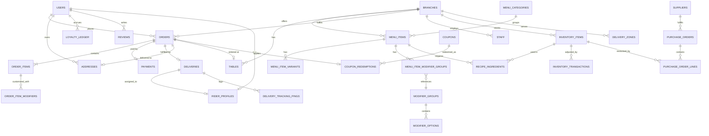

# Database Schema

PostgreSQL. Every business table carries `branch_id` so the schema supports
multiple locations without a future migration — Fresh Cup runs one branch
(Merkato) today, but the cost of scoping now is one extra foreign key,
versus a painful retrofit later. All primary keys are UUIDv7 (time-ordered,
so they stay index-friendly while remaining non-guessable). Money is stored
as integer minor units (cents-equivalent) to avoid floating-point rounding.

## 1. Entity-relationship overview



## 2. Core tables

### `branches`
Restaurant locations. One row today (Merkato).
| Column | Type | Notes |
|---|---|---|
| id | uuid PK | |
| name | text | e.g. "Fresh Cup — Merkato" |
| address_text | text | free-text, Addis Ababa addressing |
| lat, lng | numeric | for delivery-zone geometry & maps |
| phone | text | |
| is_active | boolean | |
| opens_at, closes_at | time | per-day hours modeled in `branch_hours` if needed later |
| created_at, updated_at | timestamptz | |

### `users`
Customers **and** staff share one identity table, differentiated by `role`.
| Column | Type | Notes |
|---|---|---|
| id | uuid PK | |
| phone | text UNIQUE | E.164, primary login identifier |
| email | text UNIQUE NULL | required for staff, optional for customers |
| password_hash | text NULL | NULL for OTP-only customers |
| full_name | text | |
| role | enum | `customer`, `kitchen`, `rider`, `manager`, `admin`, `super_admin` |
| branch_id | uuid FK → branches | NULL for customers/super_admin (not branch-scoped) |
| locale | enum | `en`, `am` |
| loyalty_tier | enum | `bronze`, `silver`, `gold` (denormalized for fast reads; source of truth is `loyalty_ledger`) |
| is_active | boolean | |
| created_at, updated_at | timestamptz | |

### `otp_codes`
| id, phone, code_hash, expires_at, consumed_at, attempt_count, created_at |

### `addresses`
| id, user_id FK, label, free_text, lat, lng, is_default, created_at |

## 3. Catalog

### `menu_categories`
| id, branch_id FK, name_en, name_am, sort_order, is_active |

### `menu_items`
| id, branch_id FK, category_id FK, name_en, name_am, description_en, description_am, base_price, image_url, is_available, calories, tags (text[] e.g. `vegan`,`no-sugar-added`), sort_order, created_at, updated_at |

### `menu_item_variants`
Size options (e.g. Regular / Large) with their own price delta.
| id, menu_item_id FK, name_en, name_am, price_delta, is_default |

### `modifier_groups` / `menu_item_modifier_groups` / `modifier_options`
Add-ons (e.g. "Extra shot of ginger", "Choose your base"). A group defines
selection rules (`min_select`, `max_select`); an item links to the groups
that apply to it; options carry their own price delta.
| modifier_groups: id, name_en, name_am, min_select, max_select |
| menu_item_modifier_groups: menu_item_id FK, modifier_group_id FK |
| modifier_options: id, modifier_group_id FK, name_en, name_am, price_delta, is_available |

### `tables`
QR dine-in tables.
| id, branch_id FK, label (e.g. "T-12"), qr_token UNIQUE, is_active |

## 4. Ordering

### `orders`
| Column | Type | Notes |
|---|---|---|
| id | uuid PK | |
| branch_id | uuid FK | |
| user_id | uuid FK NULL | NULL for guest dine-in orders |
| order_type | enum | `dine_in`, `pickup`, `delivery` |
| table_id | uuid FK NULL | set when `dine_in` |
| address_id | uuid FK NULL | set when `delivery` |
| status | enum | `pending_payment`, `confirmed`, `preparing`, `ready`, `out_for_delivery`, `delivered`, `completed`, `cancelled` |
| subtotal, discount_total, delivery_fee, tax_total, total | integer (minor units) | |
| currency | text | `ETB` |
| coupon_redemption_id | uuid FK NULL | |
| idempotency_key | text UNIQUE | prevents duplicate order creation on client retry |
| placed_at, confirmed_at, ready_at, delivered_at | timestamptz NULL | |
| created_at, updated_at | timestamptz | |

### `order_items`
| id, order_id FK, menu_item_id FK, variant_id FK NULL, quantity, unit_price, line_total, notes |

### `order_item_modifiers`
| id, order_item_id FK, modifier_option_id FK, price_delta |

### `payments`
| id, order_id FK, provider (`chapa`), provider_reference, method (`telebirr`,`cbe_birr`,`hellocash`,`amole`,`card`), amount, status (`initiated`,`succeeded`,`failed`,`refunded`), raw_webhook_payload jsonb, created_at, updated_at |

## 5. Delivery

### `delivery_zones`
| id, branch_id FK, name, polygon (geometry / stored as GeoJSON), base_fee, per_km_fee |

### `rider_profiles`
| user_id FK PK, vehicle_type, license_plate, is_online, current_lat, current_lng, last_ping_at |

### `deliveries`
| id, order_id FK, rider_id FK NULL, status (`unassigned`,`assigned`,`picked_up`,`en_route`,`delivered`,`failed`), assigned_at, picked_up_at, delivered_at, distance_km, fee |

### `delivery_tracking_pings`
| id, delivery_id FK, lat, lng, recorded_at | — append-only, short retention (e.g. 30 days), used for the live map and post-hoc SLA analysis |

## 6. Loyalty & promotions

### `loyalty_ledger`
Append-only ledger; `users.loyalty_tier` is a cached projection.
| id, user_id FK, order_id FK NULL, points_delta, reason (`order_earned`,`redeemed`,`bonus`,`expired`), balance_after, created_at |

### `rewards_catalog`
| id, name_en, name_am, points_cost, reward_type (`free_item`,`discount_percent`,`discount_amount`), menu_item_id FK NULL, is_active |

### `coupons`
| id, code UNIQUE, discount_type (`percent`,`amount`,`free_delivery`), value, min_order_total NULL, starts_at, expires_at, max_redemptions NULL, max_redemptions_per_user NULL, is_active |

### `coupon_redemptions`
| id, coupon_id FK, user_id FK, order_id FK, redeemed_at |

## 7. Inventory

### `inventory_items`
| id, branch_id FK, name, unit (`g`,`ml`,`unit`), current_stock, reorder_threshold, unit_cost |

### `recipe_ingredients`
Maps a menu item (or variant) to the ingredients it consumes, so a paid
order can auto-deduct stock.
| id, menu_item_id FK, inventory_item_id FK, quantity_required |

### `inventory_transactions`
Append-only; every stock change (sale deduction, manual adjustment, restock, waste) is a row.
| id, inventory_item_id FK, delta, reason (`order_deduction`,`restock`,`waste`,`manual_adjustment`), reference_order_id FK NULL, actor_user_id FK NULL, created_at |

### `suppliers` / `purchase_orders` / `purchase_order_lines`
| suppliers: id, name, phone, email |
| purchase_orders: id, branch_id FK, supplier_id FK, status (`draft`,`ordered`,`received`), ordered_at, received_at |
| purchase_order_lines: id, purchase_order_id FK, inventory_item_id FK, quantity, unit_cost |

## 8. Reviews & audit

### `reviews`
| id, user_id FK, order_id FK, rating (1-5), comment, created_at |

### `audit_log`
| id, actor_user_id FK, action, entity_type, entity_id, before jsonb, after jsonb, created_at | — every admin mutation

## 9. Analytics (materialized, refreshed nightly)

- `daily_sales_summary(branch_id, date, order_count, gmv, avg_order_value, delivery_count, pickup_count, dine_in_count)`
- `item_performance(branch_id, menu_item_id, date, units_sold, revenue)`
- `customer_cohort_retention(branch_id, cohort_month, months_since, retained_customers)`

These exist purely so the Admin Analytics dashboard never runs expensive
aggregate queries against the live `orders`/`order_items` tables that
checkout depends on.

## 10. Indexing notes

- `orders(branch_id, status, created_at)` — kitchen display & admin order list
- `orders(user_id, created_at)` — customer order history
- `menu_items(branch_id, category_id, is_available)` — menu reads (also cached in Redis)
- `loyalty_ledger(user_id, created_at)` — points history
- `delivery_tracking_pings(delivery_id, recorded_at)` — live tracking replay
- Partition `orders` and `delivery_tracking_pings` by month once volume warrants it (Phase 7)

## 11. Sample DDL sketch (illustrative, not exhaustive)

```sql
create type order_status as enum (
  'pending_payment','confirmed','preparing','ready',
  'out_for_delivery','delivered','completed','cancelled'
);

create table branches (
  id uuid primary key default uuid_generate_v7(),
  name text not null,
  address_text text not null,
  lat numeric(9,6),
  lng numeric(9,6),
  phone text,
  is_active boolean not null default true,
  created_at timestamptz not null default now(),
  updated_at timestamptz not null default now()
);

create table orders (
  id uuid primary key default uuid_generate_v7(),
  branch_id uuid not null references branches(id),
  user_id uuid references users(id),
  order_type text not null check (order_type in ('dine_in','pickup','delivery')),
  table_id uuid references tables(id),
  address_id uuid references addresses(id),
  status order_status not null default 'pending_payment',
  subtotal integer not null,
  discount_total integer not null default 0,
  delivery_fee integer not null default 0,
  tax_total integer not null default 0,
  total integer not null,
  currency text not null default 'ETB',
  idempotency_key text not null unique,
  placed_at timestamptz,
  confirmed_at timestamptz,
  ready_at timestamptz,
  delivered_at timestamptz,
  created_at timestamptz not null default now(),
  updated_at timestamptz not null default now()
);

create index orders_branch_status_idx on orders (branch_id, status, created_at);
create index orders_user_idx on orders (user_id, created_at);
```

Full DDL will live in Prisma schema files (`apps/api/prisma/schema.prisma`)
once implementation begins — this document is the design reference those
migrations are generated from.
