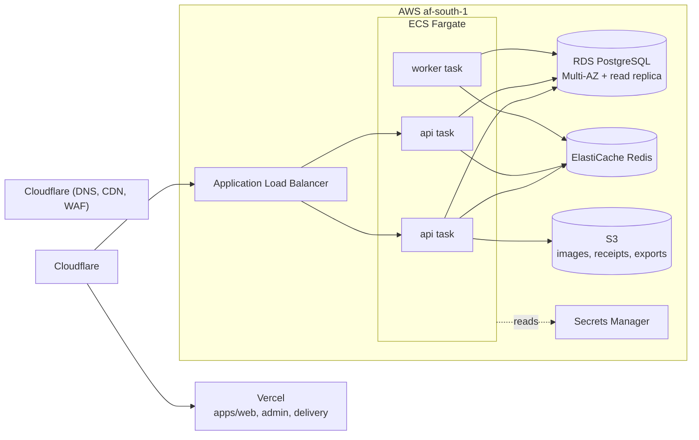
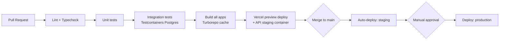

# Deployment Architecture

## Environments

| Environment | Purpose | Data |
|---|---|---|
| `local` | Developer machines | Docker Compose: Postgres, Redis, MinIO (S3-compatible), API, seeded fixtures |
| `staging` | Pre-production verification, QA, demo | Isolated DB, sandbox Chapa credentials, sandbox SMS |
| `production` | Real customers | Live DB, live payment/SMS credentials, backups enabled |

Promotion path: every merge to `main` deploys to `staging` automatically;
promotion to `production` is a manual, explicit action (tagged release),
never automatic — order/payment correctness bugs in production are the
single most expensive category of mistake this system can make.

## Infrastructure (target: AWS, region `af-south-1` — Cape Town, the closest
AWS region to Addis Ababa; re-evaluate latency vs. `eu-central-1` once
real traffic data exists)

- **Next.js apps (`web`, `admin`, `delivery`)** deploy to **Vercel** —
  global edge network (fast for customers across low-bandwidth
  connections), zero-ops for a small team, generous free/low tier for a
  single-restaurant launch. Origin points at the same custom domain
  structure behind Cloudflare for unified DNS/WAF.
- **API (`apps/api`)** runs as **ECS Fargate** tasks behind an ALB — no
  Kubernetes: this team doesn't need cluster-ops overhead at this scale,
  and Fargate gives the same "container in, scaling out" benefit with far
  less operational surface. Revisit only if/when multi-region active-active
  is required.
- **PostgreSQL**: RDS, Multi-AZ for production (automatic failover), one
  read replica for analytics/reporting queries.
- **Redis**: ElastiCache, used for cache + session + BullMQ queue + Socket.IO
  pub/sub adapter.
- **Object storage**: S3, `fresh-cup-prod-media` bucket, CloudFront (or
  Cloudflare) in front for image delivery with resize-on-request.
- **Secrets**: AWS Secrets Manager, injected into ECS tasks at runtime;
  nothing sensitive in environment files committed to git.
- **Mobile**: Expo Application Services (EAS) — `eas build` for
  Play Store/App Store binaries, `eas update` for OTA JS-only patches
  between store releases.

## CI/CD pipeline (GitHub Actions)

- Database migrations (`prisma migrate deploy`) run as an explicit pipeline
  step before the new API version receives traffic, with an automatic
  rollback path if migration fails
- OpenAPI contract diff checked on every PR — a breaking change to a field
  a mobile app depends on fails CI rather than shipping silently
- Mobile: EAS Build triggered on release-tagged commits; OTA updates for
  JS-only changes can ship independently of the app-store review cycle
- Dependabot/Renovate keeps dependencies current; `npm audit --audit-level=high` blocks merge

## Backups & disaster recovery

- RDS automated daily snapshots, 7-day point-in-time recovery minimum
- S3 versioning enabled on the media bucket
- Quarterly restore drill: restore a snapshot into a scratch environment
  and verify the API boots against it — an untested backup is not a backup
