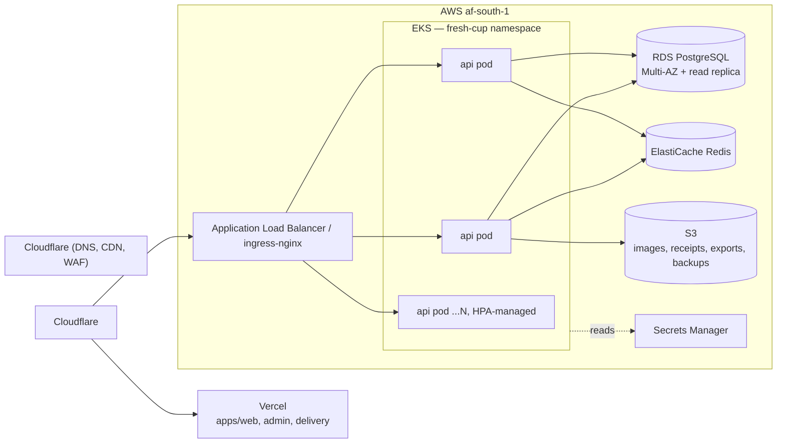
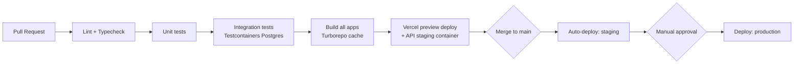

# Deployment Architecture

## Environments

| Environment  | Purpose                               | Data                                                                         |
| ------------ | ------------------------------------- | ---------------------------------------------------------------------------- |
| `local`      | Developer machines                    | Docker Compose: Postgres, Redis, MinIO (S3-compatible), API, seeded fixtures |
| `staging`    | Pre-production verification, QA, demo | Isolated DB, sandbox Chapa credentials, sandbox SMS                          |
| `production` | Real customers                        | Live DB, live payment/SMS credentials, backups enabled                       |

Promotion path: every merge to `main` deploys to `staging` automatically;
promotion to `production` is a manual, explicit action (tagged release),
never automatic — order/payment correctness bugs in production are the
single most expensive category of mistake this system can make.

## Infrastructure (target: AWS, region `af-south-1` — Cape Town, the closest

AWS region to Addis Ababa; re-evaluate latency vs. `eu-central-1` once
real traffic data exists)

- **Next.js apps (`web`, `admin`, `delivery`)** deploy to **Vercel** —
  global edge network (fast for customers across low-bandwidth
  connections), zero-ops for a small team, generous free/low tier for a
  single-restaurant launch. Origin points at the same custom domain
  structure behind Cloudflare for unified DNS/WAF.
- **API (`apps/api`)** runs on **Kubernetes** (`infra/k8s/`, target: AWS
  EKS) — this supersedes the plan this document originally carried
  ("ECS Fargate, no Kubernetes, revisit only for multi-region
  active-active"). Phase 12 Part 5 built the Kubernetes path explicitly
  (blue/green + canary deployment strategies need more control over
  traffic-shaping than ECS/ALB target groups offer cleanly), so that's
  now the actual deployment target; ECS Fargate is no longer the plan.
  See "Kubernetes deployment" below for the manifests.
- **PostgreSQL**: RDS, Multi-AZ for production (automatic failover), one
  read replica for analytics/reporting queries.
- **Redis**: ElastiCache, used for cache + session + Socket.IO pub/sub
  adapter.
- **Object storage**: S3, `fresh-cup-prod-media` bucket (images/receipts/
  exports) and a separate `fresh-cup-prod-backups` bucket (see "Backups &
  disaster recovery" below), CloudFront (or Cloudflare) in front of the
  media bucket for image delivery with resize-on-request.
- **Secrets**: AWS Secrets Manager, synced into the cluster (e.g. via
  External Secrets Operator) as the `fresh-cup-api-secrets` Kubernetes
  Secret (`infra/k8s/base/secret.example.yaml` is the template — never
  commit real values); nothing sensitive in environment files committed
  to git.
- **Mobile**: Expo Application Services (EAS) — `eas build` for
  Play Store/App Store binaries, `eas update` for OTA JS-only patches
  between store releases.

## Kubernetes deployment

Manifests live in `infra/k8s/` (`infra/k8s/README.md` has the full
breakdown) — real, `kubectl apply`-able YAML, reviewed but not exercised
against a live cluster in this environment:

- **`base/`** — steady state: `Namespace`, `ConfigMap`/`Secret` template,
  `Deployment` (3–12 replicas, rolling update, resource requests/limits,
  liveness/readiness/startup probes wired to the existing `/health` and
  `/health/ready` endpoints), `Service`, `HorizontalPodAutoscaler`
  (CPU 70% / memory 80% target, asymmetric scale-up/scale-down behavior
  tuned for lunch/dinner-rush bursts), `PodDisruptionBudget`, `Ingress`.
  Apply with `kubectl apply -k infra/k8s/base`.
- **`blue-green/`** — an alternate `api-blue`/`api-green` `Deployment`
  pair plus `switch.sh`, which patches the `Service` selector between
  them. Vanilla Kubernetes has no built-in blue/green primitive; this is
  the standard "two Deployments, one Service, flip the selector"
  approach, not Argo Rollouts/Flagger (a materially heavier new
  dependency for a single-service platform this size).
- **`canary/`** — a canary `Deployment` (fixed, small replica count) plus
  an `Ingress` using ingress-nginx's `canary-weight` annotation for real
  weighted traffic splitting — genuine partial rollout, not a
  replica-count approximation.

### CI/CD (`.github/workflows/fresh-cup-deploy.yml`)

Separate from `fresh-cup-ci.yml` (lint/typecheck/build/test on every PR,
unchanged): build & push the image → point the canary `Deployment` at it
and set its traffic weight → a **manual soak-gate** GitHub Environment
(required reviewers confirm the canary looks healthy against the alert
rules in `infra/observability/alert-rules.yaml`) → promote by rolling the
new image out to the stable `Deployment` and scaling the canary back to
zero. Triggered by an `api-v*` tag push or manual dispatch — this is a
documented pipeline, not something with real cluster credentials wired
into this repo's secrets yet.

## CI/CD pipeline (GitHub Actions)

- Database migrations (`prisma migrate deploy`) run as an explicit pipeline
  step before the new API version receives traffic, with an automatic
  rollback path if migration fails
- OpenAPI contract diff checked on every PR — a breaking change to a field
  a mobile app depends on fails CI rather than shipping silently
- Mobile: EAS Build triggered on release-tagged commits; OTA updates for
  JS-only changes can ship independently of the app-store review cycle
- Dependabot/Renovate keeps dependencies current; `npm audit --audit-level=high` blocks merge

## Backups & disaster recovery

Implemented in `infra/backup/` (full runbook: `infra/backup/README.md`),
RPO ≤24h / RTO ≤1h:

- **`fresh-cup-pg-backup`** — a nightly Kubernetes `CronJob`
  (`infra/backup/backup-cronjob.yaml`) running `pg_dump --format=custom`
  to S3-compatible storage, pruning archives past
  `BACKUP_RETENTION_DAYS` (default 30). RDS automated snapshots (daily,
  7-day PITR minimum) remain a second, independent line of defense if
  deployed onto RDS rather than a self-managed Postgres.
- **`fresh-cup-pg-restore-test`** — a weekly `CronJob`
  (`infra/backup/restore-test-cronjob.yaml`) that downloads the most
  recent backup archive, restores it into a disposable database, checks
  migrations applied and core tables have rows, then drops it. This is
  the part a snapshot-only backup strategy usually skips: a backup
  nobody has ever restored is not a verified backup. A failed restore
  test fails the Kubernetes Job, which
  `infra/observability/alert-rules.yaml`'s `FreshCupRestoreTestFailed`
  rule turns into an alert.
- S3 versioning enabled on both the media and backup buckets.
- Manual restore procedure for a real incident is documented step by
  step in `infra/backup/README.md`.

## Observability & alerting

Implemented in `infra/observability/` (`infra/observability/README.md`
has the full breakdown) and `apps/api/src/common/observability/` —
metrics, log shipping, and alert-rule configs to plug into a real
Prometheus/Loki/Tempo stack; see `ARCHITECTURE.md` §13 for the
application-level detail (traceId propagation, structured logging,
`/metrics`). None of these have a live backend running in this
environment — they're reviewed, valid configs, not something exercised
end-to-end yet.
